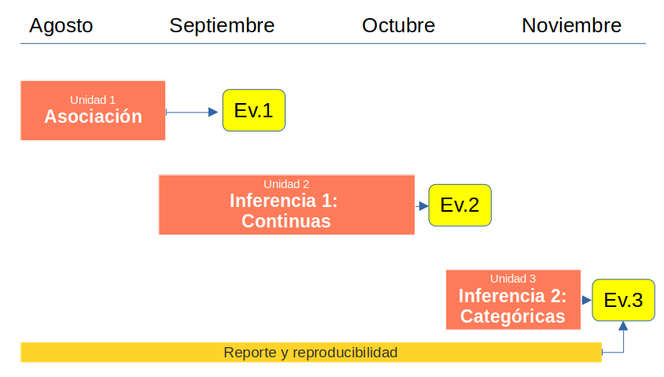

class: front


```{r setup, include=FALSE, cache = FALSE}
require("knitr")
options(htmltools.dir.version = FALSE)
pacman::p_load(RefManageR)
# bib <- ReadBib("../../bib/electivomultinivel.bib", check = FALSE)
opts_chunk$set(warning=FALSE,
             message=FALSE,
             echo=FALSE,
             cache = FALSE, fig.width=7, fig.height=5.2)
pacman::p_load(flipbookr, tidyverse)
```


```{r xaringanExtra, include=FALSE}
xaringanExtra::use_xaringan_extra(c("tile_view", "animate_css"))
xaringanExtra::use_scribble()
```

.pull-left-wide[
# Estadística Correlacional]

.pull-right-narrow[]

## Asociación, inferencia y reporte

----
.pull-left[

## Juan Carlos Castillo
## Sociología FACSO - UChile
## 2do Sem 2023 
## [.orange[correlacional.netlify.com]](https://encuestas-sociales.netlify.com)
]
    

.pull-right-narrow[
.center[
.content-block-gray[
## Sesión 1: 
# .orange[Presentación]]
]
]
---

layout: true
class: animated, fadeIn

---

<iframe src="https://www.mentimeter.com/app/presentation/alicgp8h2kyx1ozk2x77oqkv5vpfjwyu/kfwq8a8kxaxu" height="600" width=100% allowfullscreen="true">
</iframe>

---
# Algunos mitos

--

.pull-left[


]

--

.pull-right[
- positivismo

- predominante

- foco en los números

- cuadrado

- masculino

- verdad absoluta

]


---
class: inverse, middle, center, animated, slideInRight


# .orange[¿Por qué estudiar estadística en sociología?]


---
class: middle

.pull-left[
.content-box-red[
.center[
# Imaginación sociológica

Relación del individuo con la sociedad y con la historia

Individuos en contexto social

(C.Wright Mills)]
]
]
.pull-right[
.center[
.content-box-green[
# Imaginación estadística

Una apreciación de que tan usual o inusual es un evento, circunstancia o comportamiento, en relación con un conjunto mayor de eventos similares

(Ritchey, 2008)
]
]]

---
class: inverse middle center

## *"Adquirir la imaginación estadística es abrir los ojos a una representación más amplia de la realidad y superar malentendidos, prejuicios y estrechez de pensamiento"* (Ritchey, 2008, p.3)

---

.pull-left[
# Estadística:
"Rama de la matemática que utiliza grandes conjuntos de datos numéricos para obtener inferencias basadas en el cálculo de probabilidades". (RAE)]

--

.pull-right[

# Dos características: 

- **humildad**: la inferencia siempre posee una probabilidad de error

- **pretensión**: podemos medir y establecer qué grado de error estamos cometiendo
]
---
class: inverse middle center

## _"El problema con el mundo es que las personas inteligentes están llenas de dudas, mientras que las estúpidas están llenas de certezas"_ (Bukowski)

---
class: middle center


---
class: roja

# Este curso

---
# Ciclo de formación en métodos cuantitativos


---
class: middle

.pull-left[
.content-box-red[
.center[
# Estadística descriptiva

Número de observaciones registradas y frecuencia de esas observaciones (en una muestra o en la población)
]
]
]

.pull-right[
.center[
.content-box-green[
# Estadística inferencial

Contraste de hipótesis y teorías científicas en base a datos de investigación
]
]]


---
# Sobre el sentido general del curso
En este curso vamos a aprender tres cosas principales:

1. **Inferencia**: los resultados que encontramos en nuestra muestra, ¿se encuentran también en la población de la cual proviene la muestra?

2. **Asociación** entre variables: tamaño y significación estadística

3. **Reporte y reproducibilidad**

---
# Organización general
.center[

]
---
# Organización semanal 
  


---
# Consideraciones


.pull-left[
- comunicación eficiente

- participación

- puntualidad
]

.pull-right[
- asistencia

- lecturas

- monitoreo
]
---
class: roja
# Web:


# [.yellow[correlacional.netlify.app]](https://correlacional.netlify.app)

---
class: front

.pull-left-wide[
# Estadística Correlacional]

.pull-right-narrow[]

## Asociación, inferencia y reporte

----
.pull-left[

## Juan Carlos Castillo
## Sociología FACSO - UChile
## 2do Sem 2023 
## [.orange[correlacional.netlify.com]](https://encuestas-sociales.netlify.com)
]
    


