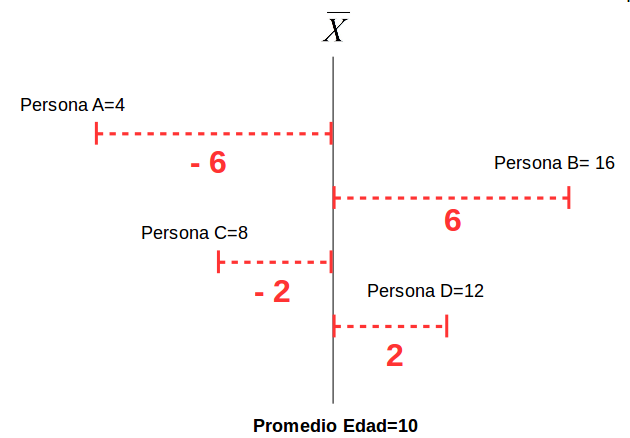

class: front


```{r setup, include=FALSE, cache = FALSE}
require("knitr")
options(htmltools.dir.version = FALSE)
pacman::p_load(RefManageR)
# bib <- ReadBib("../../bib/electivomultinivel.bib", check = FALSE)
opts_chunk$set(warning=FALSE,
             message=FALSE,
             echo=TRUE,
             cache = FALSE, fig.width=10, fig.height=8)
pacman::p_load(flipbookr, tidyverse, kableExtra)
```


```{r xaringanExtra, include=FALSE}
xaringanExtra::use_xaringan_extra(c("tile_view", "animate_css"))
xaringanExtra::use_scribble()
```

.pull-left-wide[
# Estadística Correlacional]

.pull-right-narrow[]

## Asociación, inferencia y reporte

----
.pull-left[

## Juan Carlos Castillo
## Sociología FACSO - UChile
## 2do Sem 2023 
## [.orange[correlacional.netlify.com]](https://encuestas-sociales.netlify.com)
]


.pull-right-narrow[
.center[
.content-block-gray[
## Sesión 3: 
# .orange[Correlación de Pearson]]
]
]
---

layout: true
class: animated, fadeIn


---
class: roja

## Objetivos de la sesión de hoy
<br>

### 1. Comprender los conceptos de covarianza y correlación

### 2. Aprender el cálculo de ambos coeficientes y su interpretación

### 3. Entender las limitaciones del coeficiente y su consideración en el cálculo e interpretación

---
class: middle center

# Lectura: Moore 97-131 Análisis de relaciones

---
class: roja right

# Contenidos

.pull-left-narrow[
]

.pull-right-wide[

## .yellow[1- Resumen sesión anterior]

## 2- Covarianza y correlación: Cálculo e interpretación

## 3- Limitaciones

]

---
# Sobre el sentido general del curso
En este curso vamos a aprender tres cosas principales:

1. **Inferencia**: los resultados que encontramos en nuestra muestra, ¿se encuentran también en la población de la cual proviene la muestra?

2. **Asociación** entre variables: tamaño y significación estadística

3. **Reporte y reproducibilidad**


---
# Conceptos básicos (estadística descriptiva)

- Datos

- Variables
  - tipos
  - niveles de medición

- Tendencia central
- Varianza y desviación estándar = medidas de dispersión


---
class: roja right

# Contenidos

.pull-left-narrow[
]

.pull-right-wide[

## 1- Resumen sesión anterior

## 2- .yellow[Covarianza y correlación: Cálculo e interpretación]

## 3- Limitaciones

]

---
# Siguiendo con ejemplo: educación e ingreso

- simulamos datos para

  - 8 casos

  - 8 niveles de .red[educación] (ej: desde basica incompleta=1 hasta postgrado=8)
  
  - 12 niveles de rangos de .red[ingreso] (ej: desde menos de 100.000=1 hasta más de 10.000.000=12)


---
# Generación de datos para el ejemplo

.pull-left[
```{r, echo=T}
educ <-c(2,3,4,4,5,7,8,8)
ing <-c(1,3,3,5,4,7,9,11)

data <-data.frame(educ,ing)
```
]


.pull-right[
.small[
```{r}
kableExtra::kbl(data)
```
]
]

---
class: middle center


---
class: inverse middle center

## Midiendo dispersión:
<br>
#### $$Varianza=\sigma^{2}={\sum_{i=1}^{N}(x_{i}-\bar{x})^{2}\over {N - 1}}$$ 
---

.pull-left-narrow[
<br>
<br>
<br>
<br>
<br>
$$\sigma^{2}={\sum_{i=1}^{N}(x_{i}-\bar{x})^{2}\over {N - 1}}$$
]


.pull-right-wide[


]

---

.pull-left-narrow[
<br>
<br>
<br>
<br>
<br>
$$\sigma^{2}={\sum_{i=1}^{N}(x_{i}-\bar{x})^{2}\over {N - 1}}$$
]


.pull-right-wide[


]

---

```{r, echo=FALSE}
data$id <- seq(1,8) # agregar para graficos univariados
ggplot(
  data = data, 
  aes(y = educ, x = id)) + 
  geom_point() +
  geom_hline(yintercept=5.12) +
  annotate("text", x=7.5, y=4.8, 
           label="Prom Educ") +
  geom_segment(aes(y=5.12, yend = educ, 
                  xend=id,  color = "resid")) +
  scale_color_discrete(name="") +
  theme(text = element_text(size = 20)) +
  scale_y_continuous(breaks=seq(0,8,1)) +
  scale_x_continuous(breaks=seq(0,8,1))

```


---
.pull-left[
# Varianza educación

$$Varianza=\sigma^{2}={\sum_{i=1}^{N}(x_{i}-\bar{x})^{2}\over {N - 1}}$$

.small[
```{r}
mean(data$educ)
```

```{r}
data$mean_educ <- mean(data$educ)
data$dif_m_educ <- data$educ-data$mean_educ  
data$dif_m_educ2 <- (data$dif_m_educ)^2
```
]]

--

.pull-right[
.small[
```{r}
kbl(data, digits = 2) %>% 
  scroll_box(width = "500px", height = "450px")
```
]
]

---
.pull-left[

.small[
```{r, echo=FALSE}
kableExtra::kbl(data, digits = 2) %>% 
  scroll_box(width = "500px", height = "450px")
```
]
.medium[
```{r}
sum(data$dif_m_educ2)
```
]
]

--

.pull-right[

# Varianza educación

\begin{align*}
Varianza =\sigma^{2} &={\sum_{i=1}^{N}(x_{i}-\bar{x})^{2}\over {N - 1}}\\
\sigma^{2} &={(36,875)\over {7 - 1}}\\
\sigma^{2} &= 5,267\\
\end{align*}

.small[
```{r}
var(data$educ)
```
]
]


---
# Varianza ingreso
.pull-left[

.small[
```{r}
mean(data$ing)
```

```{r}
data$mean_ing <- mean(data$ing)
data$dif_m_ing <- data$ing-data$mean_ing 
data$dif_m_ing2 <- (data$dif_m_ing)^2
sum(data$dif_m_ing2)
```
]]

.pull-right[


\begin{align*}
Varianza =\sigma^{2} &={\sum_{i=1}^{N}(x_{i}-\bar{x})^{2}\over {N - 1}}\\
\sigma^{2} &={(79,875)\over {7 - 1}}\\
\sigma^{2} &= 11.41071\\
\end{align*}

.medium[
```{r}
var(data$ing)
```
]
]

---
class: inverse

## ¿Por qué es importante la varianza?

<br>
.content-box-gray[
###- .black[Indica la dispersion (variabilidad) de los datos en torno al promedio]

###- .black[Permite establecer relaciones entre variables:] .red[covarianza]
]
---
# Asociación 

.pull-left-narrow[
.small[
<br>
```{r echo=FALSE}
data %>% select(id,educ,ing) %>%  kbl(.)
```
]
]

.pull-right-wide[
.center[

]
]


---

.pull-left-narrow[
.medium[
```{r}
plot1 <- ggplot(data, 
  aes(x=educ, y=ing)) + 
  geom_point(
    colour = "red", 
    size = 5) +
  theme(text = 
    element_text(size = 20))
```
]]

.pull-right-wide[
```{r, echo=FALSE,fig.height=8 }
plot1
```

]


---

.pull-left-wide[

```{r, echo=FALSE,fig.height=8 }
plot1
```
]

.pull-right-narrow[
<br>
<br>
<br>
<br>
.content-box-red[
¿Cómo expresar matemáticamente este patrón de asociación?]
]

---
## Hacia la covarianza

.pull-left[
```{r, echo=FALSE}
ggplot(
  data = data, 
  aes(y = educ, x = id)) + 
  geom_point() +
  geom_hline(yintercept=5.12) +
  annotate("text", x=7.5, y=4.8, 
           label="Prom Educ") +
  geom_segment(aes(y=5.12, yend = educ, 
                  xend=id,  color = "resid")) +
  scale_color_discrete(name="") +
  theme(text = element_text(size = 20)) +
  scale_y_continuous(breaks=seq(0,8,1)) +
  scale_x_continuous(breaks=seq(0,8,1))

```
.center[
### Educación
]

]
.pull-right[
```{r, echo=FALSE}
ggplot(
  data = data, 
  aes(y = ing, x = id)) + 
  geom_point() +
  geom_hline(yintercept=5.375) +
  annotate("text", x=7.5, y=4.8, 
           label="Prom Ing.") +
  geom_segment(aes(y=5.375, yend = ing, 
                  xend=id,  color = "resid")) +
  scale_color_discrete(name="") +
  theme(text = element_text(size = 20)) +
  scale_y_continuous(breaks=seq(0,12,1)) +
  scale_x_continuous(breaks=seq(0,8,1))

```
.center[
### Ingreso
]

]

---
# Covarianza


.pull-left[
.center[
### Varianza educación (x)

$$\sigma_{edu}^{2}={\sum_{i=1}^{N}(x_{i}-\bar{x})^{2}\over {N - 1}}$$
$$\sigma_{edu}^{2}={\sum_{i=1}^{N}(x_{i}-\bar{x})(x_{i}-\bar{x})\over {N - 1}}$$

]


]
.pull-right[

.center[
### Varianza ingreso (y)

$$\sigma_{ing}^{2}={\sum_{i=1}^{N}(y_{i}-\bar{y})^{2}\over {N - 1}}$$
$$\sigma_{ing}^{2}={\sum_{i=1}^{N}(y_{i}-\bar{y})(y_{i}-\bar{y})\over {N - 1}}$$

]

]

--
.content-box-red[
$$Covarianza=cov(x,y) = \frac{\sum_{i=1}^{N}(x_i - \bar{x})(y_i - \bar{y})} {N-1}$$
]

---
# Cálculo covarianza

.pull-left-narrow[
.small[
```{r}
data$dif_xy <-
  data$dif_m_educ*
  data$dif_m_ing
```

```{r,eval=FALSE}
data %>% select(educ,ing,
        dif_m_educ,
        dif_m_ing, 
        dif_xy) %>% kbl
```

]
]

--

.pull-right-wide[
.small[
```{r echo=FALSE}
data %>% select(educ,ing,dif_m_educ,dif_m_ing, dif_xy) %>% kbl
```

```{r}
sum(data$dif_xy)
```
]
]

---
# Covarianza

\begin{align*}
Covarianza=cov(x,y) &= \frac{\sum_{i=1}^{n}(x_i - \bar{x})(y_i - \bar{y})} {N-1} \\
 &= \frac{51.625} {8-1} \\
 &=7.375
\end{align*}


```{r}
cov(data$educ,data$ing)
```

---
class: inverse center

#### La .roja[covarianza] es una medida de asociación entre variables basada en la variabilidad de cada una de ellas

--

#### La distancia del promedio del valor de una variable (residuo): ¿tiene relación con el residuo de otra variable?

--

#### Expresa la medida en que los valores de cada variable se distancian respectivamente de su promedio 

--

#### .red[Su valor no es interpretable directamente]


---
# Correlación producto-momento de Pearson

.pull-left-narrow[

]

.pull-right-wide[
<br>
- Medida estandarizada de covarianza

- Basada en los trabajos de Galton y de Bravais

- Desarrollada por Karl Pearson (1857-1936): físico, matemático, estadístico y germanista. Y eugenista ...

]

---
# Correlación producto-momento (Pearson)

\begin{align*}
Covarianza = cov(x,y) &= \frac{\sum_{i=1}^{n}(x_i - \bar{x})(y_i - \bar{y})} {n-1}\\
\\
Correlación=r &= \frac{\sum_{i=1}^{n}(x_i - \bar{x})(y_i - \bar{y})} {(n-1)\sigma_x \sigma_y }\\ \\
 &= \frac{\sum(x-\bar{x})(y-\bar{y})}{\sqrt{\sum(x-\bar{x})^{2} \sum(y-\bar{y})^{2}}}
\end{align*}

---
## Cálculo correlación

.pull-left[
.small[
```{r echo=FALSE}
data %>% select(educ,ing,dif_m_educ2,dif_m_ing2, dif_xy) %>% kbl(., digits = 2) %>% 
  scroll_box(width = "500px", height = "450px")
```

]
]

.pull-right[
$$r=\frac{\sum(x-\bar{x})(y-\bar{y})}{\sqrt{\sum(x-\bar{x})^{2} \sum(y-\bar{y})^{2}}}$$


```{r}
sum(data$dif_xy); sum(data$dif_m_educ2);sum(data$dif_m_ing2)
```

]

---

## Cálculo correlación
.pull-left[


\begin{align*}
r &= \frac{\sum(x-\bar{x})(y-\bar{y})}{\sqrt{\sum(x-\bar{x})^{2} \sum(y-\bar{y})^{2}}} \\ \\
&= \frac{51.625}{ \sqrt{36.875*79.875}} \\ \\
&= \frac{51.625}{54.271} \\ \\
&= 0.951
\end{align*}

]

--

.pull-right[

```{r}
cor(data$educ,data$ing)
```
]

---
class: roja

## Interpretación

- El coeficiente de correlación (de Pearson) es una medida de asociación lineal entre variables, que indica el sentido y la fuerza de la asociación

--

- Varía entre +1 y -1, donde

  - valores .black[positivos] indican relación directa (aumenta una, aumenta la otra)
  
  - valores .black[negativos] indican relación inversa (aumenta una, disminuye la otra)
  
---
# Nubes de puntos (scatterplot)

.center[
]

---
# Nubes de puntos (scatterplot)

.center[

]

---
# Nubes de puntos (scatterplot)

.center[

]
---
class: middle center
## Adivine la correlación:

# [guessthecorrelation.com](https://www.guessthecorrelation.com)


---
# Nubes de puntos (scatterplot)

.center[

]

---
class: roja right

# Contenidos

.pull-left-narrow[
]

.pull-right-wide[

## 1- Resumen sesión anterior

## 2- Covarianza y correlación: Cálculo e interpretación

## 3- .yellow[Limitaciones]

]

---
# Limitaciones

- medida de asociación .roja[lineal] entre variables

- no captura apropiadamente asociaciones no lineales

- posee supuestos distribucionales de x e y (distribución normal)

- sensible a valores extremos

- un mismo coeficiente puede reflejar distintas distribuciones bivariadas

---
.center[

]

---
class: bottom right 

class: roja

## Próxima clase:

# Correlación 3: Matrices y tamaños de efecto

### Además: Otros coeficientes de correlación, datos perdidos y coeficiente de determinación
- Lectura obligatoria: [.yellow[Field 205-244 Correlation]](https://correlacional.netlify.app/files/textos/Field-correlation.pdf)

---
class: middle

# Recomendación

.pull-left[

]
.pull-right[
<br>
[Alice Lee: Correlación, inteligencia y tamaño del cráneo en hombres y mujeres](https://es.wikipedia.org/wiki/Alice_Lee)
]


---

# ASISTENCIA

.pull-left[


]

.pull-right[
<br>
<br>
<br>
<br>
<br>
bit.ly/correlacional-asistencia
]
---
class: front

.pull-left-wide[
# Estadística Correlacional]

.pull-right-narrow[]

## Asociación, inferencia y reporte

----
.pull-left[

## Juan Carlos Castillo
## Sociología FACSO - UChile
## 2do Sem 2023 
## [.orange[correlacional.netlify.com]](https://encuestas-sociales.netlify.com)
]
    


