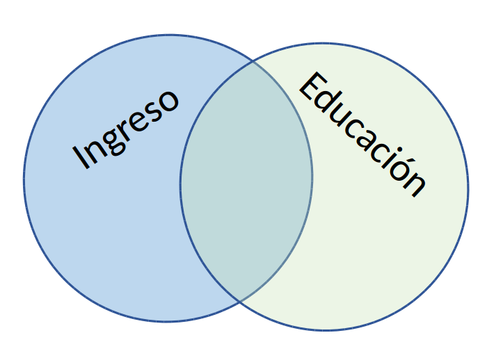
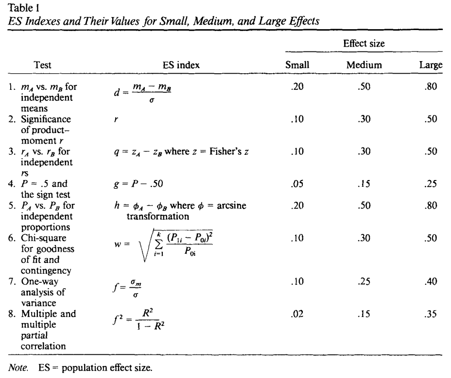

class: front


```{r setup, include=FALSE, cache = FALSE}
library(knitr)
opts_chunk$set(warning=FALSE,
             message=FALSE,
             echo=TRUE,
             comment = "",
             cache = FALSE, fig.width=10, fig.height=8)
pacman::p_load(flipbookr, tidyverse, kableExtra)
```


```{r xaringanExtra, include=FALSE}
xaringanExtra::use_xaringan_extra(c("tile_view", "animate_css"))
xaringanExtra::use_scribble()
```

.pull-left-wide[
# Estadística Correlacional]

.pull-right-narrow[]

## Asociación, inferencia y reporte

----
.pull-left[

## Juan Carlos Castillo
## Sociología FACSO - UChile
## 2do Sem 2023 
## [.orange[correlacional.netlify.com]](https:/correlacional.netlify.com)
]


.pull-right-narrow[
.center[
.content-block-gray[
## Sesión 4: 
## .orange[Tamaños de efecto, otros coeficientes y matrices]]
]
]
---

layout: true
class: animated, fadeIn

---
class: roja

## Objetivos de la sesión de hoy

### 1. Calcular e interpretar el coeficiente de determinación

### 2. Aprender a interpretar los tamaños de efecto del coeficiente de correlación


### 3. Conocer, calcular e interpretar coeficientes de correlación alternativos para datos ordinales

### 4. Reportar e interpretar matrices de correlación

---
class: middle center

# Lectura: Field 205-244 Correlation

---
class: roja right

# .black[Contenidos]

.pull-left-narrow[
]

.pull-right-wide[

### .yellow[1- Resumen sesión anterior]

### 2- Magnitud de la correlación

### 3- Otros coeficientes de correlación

### 4- Matrices de correlación

]

---


```{r, echo=F}
# Datos ejemplo
id <- seq(1,8)
educ <-c(2,3,4,4,5,7,8,8)
ing <-c(1,3,3,5,4,7,9,11)
data <-data.frame(id,educ,ing)

data$mean_educ <- mean(data$educ)
data$dif_m_educ <- data$educ-data$mean_educ  
data$dif_m_educ2 <- (data$dif_m_educ)^2
data$mean_ing <- mean(data$ing)
data$dif_m_ing <- data$ing-data$mean_ing 
data$dif_m_ing2 <- (data$dif_m_ing)^2
data$dif_xy <-
  data$dif_m_educ*
  data$dif_m_ing


```


## Hacia la covarianza

.pull-left[
```{r, echo=FALSE}
ggplot(
  data = data, 
  aes(y = educ, x = id)) + 
  geom_point() +
  geom_hline(yintercept=5.12) +
  annotate("text", x=7.5, y=4.8, 
           label="Prom Educ") +
  geom_segment(aes(y=5.12, yend = educ, 
                  xend=id,  color = "resid")) +
  scale_color_discrete(name="") +
  theme(text = element_text(size = 20)) +
  scale_y_continuous(breaks=seq(0,8,1)) +
  scale_x_continuous(breaks=seq(0,8,1))

```
.center[
### Educación
]

]
.pull-right[
```{r, echo=FALSE}
ggplot(
  data = data, 
  aes(y = ing, x = id)) + 
  geom_point() +
  geom_hline(yintercept=5.375) +
  annotate("text", x=7.5, y=4.8, 
           label="Prom Ing.") +
  geom_segment(aes(y=5.375, yend = ing, 
                  xend=id,  color = "resid")) +
  scale_color_discrete(name="") +
  theme(text = element_text(size = 20)) +
  scale_y_continuous(breaks=seq(0,12,1)) +
  scale_x_continuous(breaks=seq(0,8,1))

```
.center[
### Ingreso
]

]

---
# Covarianza


.pull-left[
.center[
### Varianza educación (x)

$$\sigma_{edu}^{2}={\sum_{i=1}^{N}(x_{i}-\bar{x})^{2}\over {N - 1}}$$
$$\sigma_{edu}^{2}={\sum_{i=1}^{N}(x_{i}-\bar{x})(x_{i}-\bar{x})\over {N - 1}}$$

]


]
.pull-right[

.center[
### Varianza ingreso (y)

$$\sigma_{ing}^{2}={\sum_{i=1}^{N}(y_{i}-\bar{y})^{2}\over {N - 1}}$$
$$\sigma_{ing}^{2}={\sum_{i=1}^{N}(y_{i}-\bar{y})(y_{i}-\bar{y})\over {N - 1}}$$

]

]

--
.content-box-red[
$$Covarianza=cov(x,y) = \frac{\sum_{i=1}^{N}(x_i - \bar{x})(y_i - \bar{y})} {N-1}$$
]


---
## Cálculo correlación

.pull-left[
.small[
```{r echo=FALSE}
data %>% select(educ,ing,dif_m_educ2,dif_m_ing2, dif_xy) %>% kbl(., digits = 2) %>% 
  scroll_box(width = "500px", height = "450px")
```

]
]

.pull-right[
$$r=\frac{\sum(x-\bar{x})(y-\bar{y})}{\sqrt{\sum(x-\bar{x})^{2} \sum(y-\bar{y})^{2}}}$$


```{r}
sum(data$dif_xy); sum(data$dif_m_educ2);sum(data$dif_m_ing2)
```

]

---

## Cálculo correlación
.pull-left[


\begin{align*}
r &= \frac{\sum(x-\bar{x})(y-\bar{y})}{\sqrt{\sum(x-\bar{x})^{2} \sum(y-\bar{y})^{2}}} \\ \\
&= \frac{51.625}{ \sqrt{36.875*79.875}} \\ \\
&= \frac{51.625}{54.271} \\ \\
&= 0.951
\end{align*}

]

--

.pull-right[

```{r}
cor(data$educ,data$ing)
```
]

---
# Nubes de puntos (scatterplot)

.center[

]
---
class: roja

## Interpretación

- El coeficiente de correlación (de Pearson) es una medida de asociación lineal entre variables, que indica el sentido y la fuerza de la asociación

--

- Varía entre +1 y -1, donde

  - valores .black[positivos] indican relación directa (aumenta una, aumenta la otra)
  
  - valores .black[negativos] indican relación inversa (aumenta una, disminuye la otra)


---
class: roja right

# .black[Contenidos]

.pull-left-narrow[
]

.pull-right-wide[

### 1- Resumen sesión anterior

### .yellow[2- Magnitud de la correlación]

### 3- Otros coeficientes de correlación

### 4- Matrices de correlación

]


---
.pull-left[

Si dos variables covarían, entonces .red[comparten varianza]


]

--

.pull-right[

<br>
<br>
# .red[¿Cuánta varianza comparten?

]
]
---
# Estableciendo la varianza compartida

.pull-left[

La varianza compartida puede pensarse como 1 - la varianza no compartida (o varianza única)

La varianza no compartida se asocia al concepto de .red[residuos], es decir, la cantidad de varianza que no está contenida en la correlación

]

.pull-right[

]
---
# Estableciendo la varianza compartida
.pull-left[
Para poder obtener los residuos vamos a generar una .red[recta] que represente la asociación entre las variables. Esta es la recta de **regresión** <sup>1</sup>

Esta recta nos permite obtener un valor estimado de $y$ para cada valor de $x$
<br>
<br>
<br>
<br>
<br>
<br>
<br>
<br>
<br>
.small[[1] Detalles próximo semestre]
]

.pull-right[

```{r echo=FALSE, fig.width=8, fig.height=6}
ggplot(data, 
  aes(x=educ, y=ing)) + 
  geom_point(
    colour = "red", 
    size = 5) +
  theme(text = 
    element_text(size = 20))+
  stat_smooth(method = "lm", 
    se = FALSE, fullrange = T)
```

]

---
.pull-left[
.small[
```{r}
reg1 <- lm(ing ~ educ, data=data)
data$predict <-predict.lm(reg1) 

plot2 <-ggplot(data, 
  aes(x=educ, y=predict)) + 
  geom_point(
    colour = "red", 
    size = 5) +
  theme(text = 
    element_text(size = 20))+
  stat_smooth(method = "lm", 
    se = FALSE, fullrange = T)


```
]
]
.pull-right[
.small[
```{r}
plot2
```
]

]

---

.center[

]

\begin{align*}
SS_{tot}&=SS_{reg} + SS_{error} \\ 
\Sigma(y_i - \bar{y})^2&=\Sigma (\hat{y}_i-\bar{y})^2 +\Sigma(y_i-\hat{y}_i)^2
\end{align*}

---
# Varianza compartida

$$SS_{tot}=SS_{reg} + SS_{error}$$

--

$$\frac{SS_{tot}}{SS_{tot}}=\frac{SS_{reg}}{SS_{tot}} + \frac{SS_{error}}{SS_{tot}}$$

--

$$1=\frac{SS_{reg}}{SS_{tot}}+\frac{SS_{error}}{SS_{tot}}$$

$$\frac{SS_{reg}}{SS_{tot}}= 1- \frac{SS_{error}}{SS_{tot}}=R^2$$

---
# ¿Qué relación tienen $R^2$ y $r$ (correlación)?

.pull-left[
$R^2=r^2$

Por lo tanto, en nuestro ejemplo:
.small[
```{r}
cor(data$educ,data$ing)
```
]
\begin{align*}
r&= 0.95 \\
r^2&=0.95 ^2 \\
r^2&=0.902 = R^2
\end{align*}

]
--

.pull-right[
.content-box-red[
Intepretación:

_El porcentaje de varianza compartida entre educación e ingreso es de 90%._

_Es decir, ambas variables comparten el 90% de su varianza_
]]
---
# $R^2$ o coeficiente de determinación

- ¿Cuánto de los ingresos se asocia a educación, y viceversa?

--

- el $R^2$
  - es la proporción de la varianza de Y que se asocia a X
  
  - varía entre 0 y 1, y usualmente se expresa en porcentaje

---
# Criterios de Cohen para tamaños de efecto

- El coeficiente de correlación $r$ de Pearson nos indica la dirección y la fuerza/intensidad de la asociación. 

- Pero, ¿qué nos dice el tamaño del coeficiente? Por ejemplo, si el coeficiente es 0.5, ¿esto es pequeño, mediano o grande?

- Cohen (1988, 1992) sugiere una serie de criterios convencionales para clasificar efectos como pequeños, medianos o grandes.

---
class: center

---
class: middle

## Para el caso de correlación de Pearson, Cohen sugiere:

- tamaño de efecto .roja[pequeño]: alrededor de .red[0.10]

- tamaño de efecto .roja[mediano]: alrededor de .red[0.30]

- tamaño de efecto .roja[grande]: alrededor de .red[0.50] y más


---
# Resumen

- **Coeficiente de determinación** $R^2$: varianza compartida entre variables

- **Tamaño de efecto:** valores convencionales para establecer si una magnitud es pequeña, mediana o grande. 

- Varianza compartida y tamaño de efecto son relevantes de reportar junto a la información de inferencia y significación estadística (próxima unidad)

---
class: roja right

# .black[Contenidos]

.pull-left-narrow[
]

.pull-right-wide[

### 1- Resumen sesión anterior

### 2- Magnitud de la correlación

### .yellow[3- Otros coeficientes de correlación]

### 4- Matrices de correlación

]


---
# Coeficiente de correlación de Spearman 

  - se utiliza para variables ordinales y/o cuando se se violan supuestos de distribución normal
  
  - es equivalente a la correlación de Pearson del ranking de las observaciones analizadas 
  
  - es alta cuando las observaciones tienen un ranking similar
  

---
# Cálculo Spearman

- se le asigna un número de ranking a cada valor 

- el valor más bajo obtiene el mayor ranking, y el más alto el menor

- en caso de valores repetidos se produce un "empate", y entonces el ranking se promedia.

---
# Ejemplo: variable Educación

.medium[
.pull-left-narrow[
```{r}
data$educ
```

Como estos valores están ordenados de menor a mayor, entonces en principio los valores de ranking serían:

`8 7 6 5 4 3 2 1`.
]

.pull-right-wide[

<br>
<br>

Pero, hay un par de empates

  - el valor 4 está repetido y corresponden a los ranking 6 y 5, por lo tanto a ambos se les asigna el promedio de estos rankings: 5,5

  - lo mismo sucede con el valor 8 en los rankings 2 y 1, por lo tanto a ambos se les asigna el valor 1,5 ]

]

```{r, include=FALSE}
data_spr <- data %>% select (educ, ing) %>% mutate(., educ_rank=c(8,7,5.5,5.5,4,3,1.5,1.5)) %>% mutate(., ing_rank=c(8,6.5,6.5,4,5,3,2,1))
```

---

`r chunk_reveal(chunk_name="spearman")`

```{r spearman, include=FALSE, echo=F}
data %>% 
  select (educ, ing) %>% 
  mutate(., educ_rank=c(8,7,5.5,5.5,4,3,1.5,1.5)) %>% 
  mutate(., ing_rank=c(8,6.5,6.5,4,5,3,2,1))

cor(data_spr$educ_rank, data_spr$ing_rank)
```


---
Cálculo directo en `R`:

```{r}
cor.test(data$educ, data$ing, "two.sided", "spearman")
```


---
# Coeficiente de correlación Tau de Kendall

.pull-left[
- Recomendado cuando hay un set de datos pequeños y/o cuando hay mucha repetición de observaciones en el mismo ranking

- Se basa en una comparación de pares de observaciones concordantes y discordantes 

]

--

.pull-right[

En `R`:

.small[
```{r echo=TRUE}
cor.test(data$educ, data$ing,
         "two.sided", 
         "kendall")
```
]
]

---
class: inverse 
## Recomendaciones generales

- Pearson es el coeficiente de correlación por defecto

- En caso de datos en escala de medición ordinal se puede aplicar Spearman (aunque Pearson es también aceptado en este contexto).

- Kendall se reporta en casos muy específicos donde hay un set de datos pequeños y repetición de observaciones en el mismo ranking ("empates")


---
class: roja right

# .black[Contenidos]

.pull-left-narrow[
]

.pull-right-wide[

### 1- Resumen sesión anterior

### 2- Magnitud de la correlación

### 3- Otros coeficientes de correlación

### .yellow[4- Matrices de correlación]

]


---
# Matriz de correlación

- una matriz de correlación se conforma cuando se representa simultaneamente más de un par de asociaciones bivariadas

- por ejemplo, si agregamos la variable edad a nuestra base de datos:

```{r}
data$edad <- c(50, 65, 27, 15, 40, 22, 25, 38)
```

Tenemos .red[3 variables], y por lo tanto los siguentes pares de correlaciones posibles: ingreso-educación, ingreso-edad, y educación-edad


---

`r chunk_reveal(chunk_name="matriz1")`

```{r matriz1, include=FALSE, echo=F}
cor_mat <- data %>% 
  select(educ, ing, edad)   %>%
  cor(.)
cor_mat
round(cor_mat, 3)
sjPlot::tab_corr(cor_mat)
```


---
# Matriz de correlaciones

- tabla de doble entrada donde las variables se presentan tanto en las filas como en las columnas

- el coeficiente de correlación correspondiente al par de variables aparece en la intersección de las columnas

- existe información redundante

  - las correlaciones se repiten, dado que las variables se intersectan dos veces en la tabla
  - la diagonal tiene solo unos (1), ya que es la correlación de la variable consigo misma

---

`r chunk_reveal(chunk_name="matriz2", title="# Ajustando tabla sjPlot::tab_corr" )`

```{r matriz2, include=FALSE, echo=F}

sjPlot::tab_corr(cor_mat,
  triangle = "lower",
  title = "Tabla de correlaciones del ejemplo"
  )
```

---

`r chunk_reveal(chunk_name="matriz3", title="# Matriz con librería  corrplot")`

```{r matriz3, eval = F, echo = F}
library(corrplot)
corrplot(cor_mat) 
```

---

`r chunk_reveal(chunk_name="matriz31", title="# Matriz con librería  corrplot")`

```{r matriz31, eval = F, echo = F}
corrplot(cor_mat,
  method = 'number')
```

---

`r chunk_reveal(chunk_name="matriz4", title="# corrplot")`

```{r matriz4, eval = F, echo = F, fig.width=2, fig.height=2}
corrplot(cor_mat, 
  method = 'number', 
  type = 'lower', 
  number.cex = 3,
  tl.cex = 3,
  diag = FALSE)
```

---

`r chunk_reveal(chunk_name="matriz5", title="# corrplot.mixed")`

```{r matriz5, eval = F, echo = F, fig.width=2, fig.height=2}
corrplot.mixed(cor_mat, 
  lower = "number",
  upper = "circle",
  number.cex = 3,
  tl.cex = 3,
  diag = "n")
```

---

`r chunk_reveal(chunk_name="matriz6", title="# corrplot.mixed")`

```{r matriz6, eval = F, echo = F, fig.width=2, fig.height=2}
corrplot(cor_mat, 
  type = "lower",
  addCoef.col = 'white',
  number.cex = 3,
  tl.cex = 3,
  diag = FALSE)
```

---

`r chunk_reveal(chunk_name="matriz7", title="# corrplot.mixed")`

```{r matriz7, eval = F, echo = F, fig.width=2, fig.height=2}
corrplot(cor_mat, 
  type = "lower",
  addCoef.col = 'white',
  number.cex = 3,
  tl.cex = 3,
  diag = FALSE,
  method = 'square')
```

---
# Consideraciones sobre casos perdidos 

- Cuando hay casos perdidos en las variables, ¿cuál es el número de casos de la matriz de correlaciones? 

- Las correlaciones bivariadas se calculan con información completa, por lo tanto si hay un dato perdido en una de las variables se elimina el caso completo

- Algunas funciones lo hacen de manera automática, en otras hay que especificarlo previamente

---
# Ejemplo

Agreguemos un caso perdido (NA en R) a una de nuestras variables

```{r}
data$edad
data$edad <-replace(data$edad, data$edad==15, NA)
data$edad
```

---
.medium[
```{r}
cormat_NA <- data %>% select(educ, ing, edad) %>% cor(.)
round(cormat_NA,3)
```
```{r}
cormat_listwise <- data %>% select(educ, ing, edad) %>% 
  cor(., use = "complete.obs")
round(cormat_listwise, 3)
```
]


---
# Eliminación de casos perdidos por lista (o listwise)

- las correlaciones bivariadas requieren eliminación de casos perdidos tipo listwise, es decir, si hay un dato perdido en una variable se pierde el caso completo

- Para conocer el número de casos con que se calculó la matriz:

.medium[
```{r}
sum(complete.cases(data))
```
]

Por lo tanto, en el cálculo se perdió el caso o fila completa de la base (de 8 casos) que tenía el caso perdido.

---
# Eliminación de casos perdidos por pares (o pairwise)

- en el caso de las matrices de correlaciones es posible tomar la opción .red[pairwise] para casos perdidos

- pairwise quiere decir que se eliminan los casos perdidos solo cuando afectan al cálculo de un par específico.

- en el caso de nuestro ejemplo, si consideramos listwise todas las correlaciones tienen 7 casos, pero con pairwise la correlación entre educación e ingreso mantendría 8 casos.

- por lo tanto, pairwise permite mayor rescate de información y mayor N en el cálculo de matrices de correlaciones

---
# Opción pairwise en correlación en R

```{r}
data %>% select(educ, ing, edad) %>% 
  cor(., use = "pairwise")
```
En este caso vemos una leve variación en el coeficiente comprometido (educ-ing) comparando listwise con pairwise


---
# Número de casos pairwise
```{r}
data %>% select(educ,ing,edad) %>% psych::pairwiseCount() 
```
Se indica que en las correlaciones con edad se utilizaron 7 casos, mientras en la correlación entre ingreso y educación se utilizan 8 casos con el método pairwise


---
class: inverse
## Resumen

.medium[
- Reporte de correlación: además de reportar la intensidad y el sentido, acompañar reporte de tamaño de efecto y varianza compartida $R^2$ 

- Correlación de Spearman: apropiada para variables ordinales, equivale a la correlación de Pearson del ranking de las variables

- Matriz de correlaciones: forma tradicional de reporte de asociaciones de las variables de una investigación, importante considerar tratamiento de datos perdidos (listwise o pairwise)
]

---

# ASISTENCIA

.pull-left[


]

.pull-right[
<br>
<br>
<br>
<br>
<br>
bit.ly/correlacional-asistencia
]
---
class: front

.pull-left-wide[
# Estadística Correlacional]

.pull-right-narrow[]

## Asociación, inferencia y reporte

----
.pull-left[

## Juan Carlos Castillo
## Sociología FACSO - UChile
## 2do Sem 2023 
## [.orange[correlacional.netlify.com]](https://encuestas-sociales.netlify.com)
]
    


<!-- adjust font size in this css code chunk for flipbook, currently 80 -->

```{css, eval = FALSE, echo = FALSE}
.remark-code{line-height: 1.5; font-size: 80%}

@media print {
  .has-continuation {
    display: block;
  }
}

code.r.hljs.remark-code{
  position: relative;
  overflow-x: hidden;
}


code.r.hljs.remark-code:hover{
  overflow-x:visible;
  width: 500px;
  border-style: solid;
}
```


