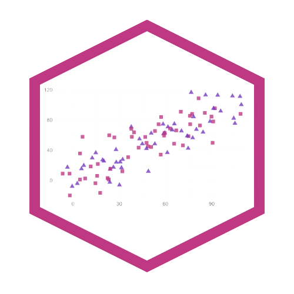
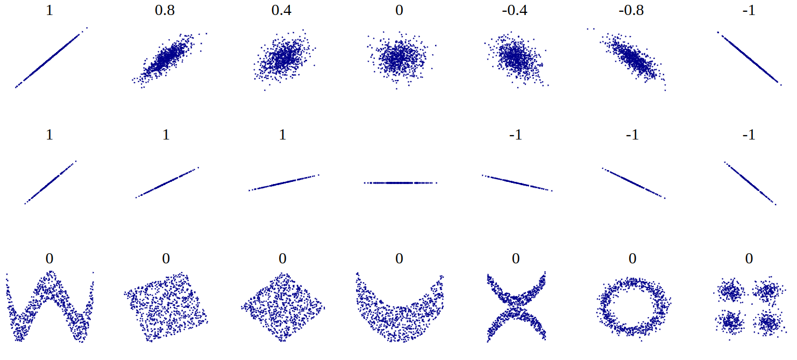
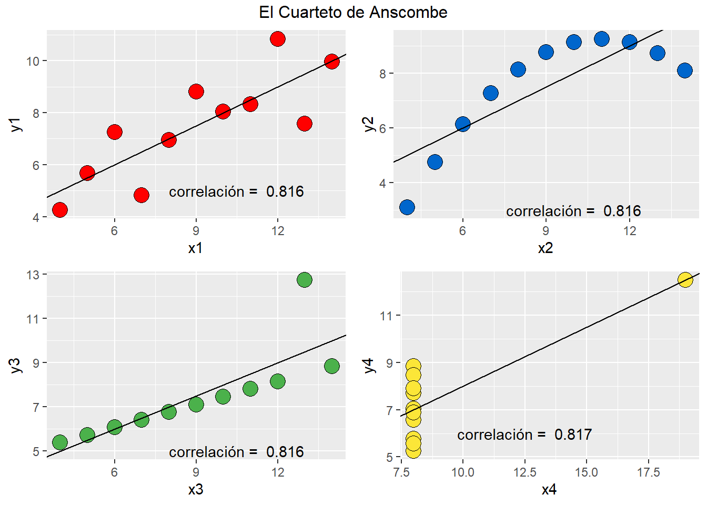

class: front


```{r setup, include=FALSE, cache = FALSE}
require("knitr")
options(htmltools.dir.version = FALSE)
pacman::p_load(RefManageR)
# bib <- ReadBib("../../bib/electivomultinivel.bib", check = FALSE)
opts_chunk$set(warning=FALSE,
             message=FALSE,
             echo=TRUE,
             cache = FALSE, fig.width=10, fig.height=8)
pacman::p_load(flipbookr, tidyverse, kableExtra)
```


```{r xaringanExtra, include=FALSE}
xaringanExtra::use_xaringan_extra(c("tile_view", "animate_css"))
xaringanExtra::use_scribble()
```

.pull-left-wide[
# Estadística Correlacional]

.pull-right-narrow[]

## Asociación, inferencia y reporte

----
.pull-left[

## Juan Carlos Castillo
## Sociología FACSO - UChile
## 2do Sem 2023 
## [.orange[correlacional.netlify.com]](https://encuestas-sociales.netlify.com)
]


.pull-right-narrow[
.center[
.content-block-gray[
## Sesión 3: 
## .orange[Matrices, tamaños & otras extensiones]]
]
]
---

layout: true
class: animated, fadeIn


---
class: roja

## Objetivos de la sesión de hoy

### 1. Calcular e interpretar el coeficiente de determinación

### 2. Aprender a interpretar los tamaños de efecto del coeficiente de correlación


### 3. Conocer, calcular e interpretar coeficientes de correlación alternativos para datos ordinales

### 4. Reportar e interpretar matrices de correlación

---
class: middle center

# Lectura: Field 205-244 Correlation

---
class: roja right

# .black[Contenidos]

.pull-left-narrow[
]

.pull-right-wide[

### .yellow[1- Resumen sesión anterior]

### 2- Magnitud de la correlación

### 3- Otros coeficientes de correlación

### 4- Matrices de correlación

]

---


```{r, echo=F}
# Datos ejemplo
id <- seq(1,8)
educ <-c(2,3,4,4,5,7,8,8)
ing <-c(1,3,3,5,4,7,9,11)
data <-data.frame(id,educ,ing)

data$mean_educ <- mean(data$educ)
data$dif_m_educ <- data$educ-data$mean_educ  
data$dif_m_educ2 <- (data$dif_m_educ)^2
data$mean_ing <- mean(data$ing)
data$dif_m_ing <- data$ing-data$mean_ing 
data$dif_m_ing2 <- (data$dif_m_ing)^2
data$dif_xy <-
  data$dif_m_educ*
  data$dif_m_ing


```


## Hacia la covarianza

.pull-left[
```{r, echo=FALSE}
ggplot(
  data = data, 
  aes(y = educ, x = id)) + 
  geom_point() +
  geom_hline(yintercept=5.12) +
  annotate("text", x=7.5, y=4.8, 
           label="Prom Educ") +
  geom_segment(aes(y=5.12, yend = educ, 
                  xend=id,  color = "resid")) +
  scale_color_discrete(name="") +
  theme(text = element_text(size = 20)) +
  scale_y_continuous(breaks=seq(0,8,1)) +
  scale_x_continuous(breaks=seq(0,8,1))

```
.center[
### Educación
]

]
.pull-right[
```{r, echo=FALSE}
ggplot(
  data = data, 
  aes(y = ing, x = id)) + 
  geom_point() +
  geom_hline(yintercept=5.375) +
  annotate("text", x=7.5, y=4.8, 
           label="Prom Ing.") +
  geom_segment(aes(y=5.375, yend = ing, 
                  xend=id,  color = "resid")) +
  scale_color_discrete(name="") +
  theme(text = element_text(size = 20)) +
  scale_y_continuous(breaks=seq(0,12,1)) +
  scale_x_continuous(breaks=seq(0,8,1))

```
.center[
### Ingreso
]

]

---
# Covarianza


.pull-left[
.center[
### Varianza educación (x)

$$\sigma_{edu}^{2}={\sum_{i=1}^{N}(x_{i}-\bar{x})^{2}\over {N - 1}}$$
$$\sigma_{edu}^{2}={\sum_{i=1}^{N}(x_{i}-\bar{x})(x_{i}-\bar{x})\over {N - 1}}$$

]


]
.pull-right[

.center[
### Varianza ingreso (y)

$$\sigma_{ing}^{2}={\sum_{i=1}^{N}(y_{i}-\bar{y})^{2}\over {N - 1}}$$
$$\sigma_{ing}^{2}={\sum_{i=1}^{N}(y_{i}-\bar{y})(y_{i}-\bar{y})\over {N - 1}}$$

]

]

--
.content-box-red[
$$Covarianza=cov(x,y) = \frac{\sum_{i=1}^{N}(x_i - \bar{x})(y_i - \bar{y})} {N-1}$$
]


---
## Cálculo correlación

.pull-left[
.small[
```{r echo=FALSE}
data %>% select(educ,ing,dif_m_educ2,dif_m_ing2, dif_xy) %>% kbl(., digits = 2) %>% 
  scroll_box(width = "500px", height = "450px")
```

]
]

.pull-right[
$$r=\frac{\sum(x-\bar{x})(y-\bar{y})}{\sqrt{\sum(x-\bar{x})^{2} \sum(y-\bar{y})^{2}}}$$


```{r}
sum(data$dif_xy); sum(data$dif_m_educ2);sum(data$dif_m_ing2)
```

]

---

## Cálculo correlación
.pull-left[


\begin{align*}
r &= \frac{\sum(x-\bar{x})(y-\bar{y})}{\sqrt{\sum(x-\bar{x})^{2} \sum(y-\bar{y})^{2}}} \\ \\
&= \frac{51.625}{ \sqrt{36.875*79.875}} \\ \\
&= \frac{51.625}{54.271} \\ \\
&= 0.951
\end{align*}

]

--

.pull-right[

```{r}
cor(data$educ,data$ing)
```
]

---
# Nubes de puntos (scatterplot)

.center[

]
---
class: roja

## Interpretación

- El coeficiente de correlación (de Pearson) es una medida de asociación lineal entre variables, que indica el sentido y la fuerza de la asociación

--

- Varía entre +1 y -1, donde

  - valores .black[positivos] indican relación directa (aumenta una, aumenta la otra)
  
  - valores .black[negativos] indican relación inversa (aumenta una, disminuye la otra)

---
.center[

]

---

[contenidos]


---
.pull-left[

Si dos variables covarían, entonces .red[comparten varianza]


]

--

.pull-right[

<br>
<br>
# .red[¿Cuánta varianza comparten?

]
]
---
class: middle

.pull-left[

Vamos a generar una .red[recta] que represente la asociación entre las variables. Esta es la recta de **regresión** <sup>1</sup>

Esta recta nos permite obtener un valor estimado de $y$ para cada valor de $x$
<br>
<br>
<br>
<br>
<br>
<br>
<br>
<br>
<br>
.small[[1] Detalles próximo semestre]
]

.pull-right[

```{r echo=FALSE, fig.width=8, fig.height=6}
ggplot(data, 
  aes(x=educ, y=ing)) + 
  geom_point(
    colour = "red", 
    size = 5) +
  theme(text = 
    element_text(size = 20))+
  stat_smooth(method = "lm", 
    se = FALSE, fullrange = T)
```

]

---
.pull-left[
.small[
```{r}
reg1 <- lm(ing ~ educ, data=data)
data$predict <-predict.lm(reg1) 

plot2 <-ggplot(data, 
  aes(x=educ, y=predict)) + 
  geom_point(
    colour = "red", 
    size = 5) +
  theme(text = 
    element_text(size = 20))+
  stat_smooth(method = "lm", 
    se = FALSE, fullrange = T)


```
]
]
.pull-right[
.small[
```{r}
plot2
```
]

]

---

.center[

]

\begin{align*}
SS_{tot}&=SS_{reg} + SS_{error} \\ 
\Sigma(y_i - \bar{y})^2&=\Sigma (\hat{y}_i-\bar{y})^2 +\Sigma(y_i-\hat{y}_i)^2
\end{align*}

---
# Varianza compartida

$$SS_{tot}=SS_{reg} + SS_{error}$$

--

$$\frac{SS_{tot}}{SS_{tot}}=\frac{SS_{reg}}{SS_{tot}} + \frac{SS_{error}}{SS_{tot}}$$

--

$$1=\frac{SS_{reg}}{SS_{tot}}+\frac{SS_{error}}{SS_{tot}}$$

$$\frac{SS_{reg}}{SS_{tot}}= 1- \frac{SS_{error}}{SS_{tot}}=R^2$$

---
# ¿Qué relación tienen $R^2$ y $r$ (correlación)?

.pull-left[
$R^2=r^2$

Por lo tanto, en nuestro ejemplo:
.small[
```{r}
cor(data$educ,data$ing)
```
]
\begin{align*}
r&= 0.95 \\
r^2&=0.95 ^2 \\
r^2&=0.902 = R^2
\end{align*}

]
--

.pull-right[
.content-box-red[
Intepretación:

_El porcentaje de varianza compartida entre educación e ingreso es de 90%._

_Es decir, ambas variables comparten el 90% de su varianza_
]]
---
# $R^2$ o coeficiente de determinación

- ¿Cuánto de los ingresos se asocia a educación, y viceversa?

--

- el $R^2$
  - es la proporción de la varianza de Y que se asocia a X
  
  - varía entre 0 y 1, y usualmente se expresa en porcentaje

---
[contenidos]


---
# Criterios de Cohen para tamaños de efecto

- El coeficiente de correlación $r$ de Pearson nos indica la dirección y la fuerza/intensidad de la asociación. 

- Pero, ¿qué nos dice el tamaño del coeficiente? Por ejemplo, si el coeficiente es 0.5, ¿esto es pequeño, mediano o grande?

- Cohen (1988, 1992) sugiere una serie de criterios convencionales para clasificar efectos como pequeños, medianos o grandes.


---
class: center

---
class: middle

## Para el caso de correlación de Pearson, Cohen sugiere:

- tamaño de efecto .roja[pequeño]: alrededor de .red[0.10]

- tamaño de efecto .roja[mediano]: alrededor de .red[0.30]

- tamaño de efecto .roja[grande]: alrededor de .red[0.50] y más


---
# Resumen

- coeficiente de determinación $R^2$: varianza compartida entre variables

- Tamaño de efecto: valores convencionales para establecer si una magnitud es pequeña, mediana o grande. 

- Varianza y tamaño compartida son relevantes de reportar junto a la información de inferencia y significación estadísta (próxima unidad)

---

[contenidos]

---
# Correlación de Spearman

- 


---
---
---
---

---
class: middle

# Recomendación


---

# ASISTENCIA

.pull-left[


]

.pull-right[
<br>
<br>
<br>
<br>
<br>
bit.ly/correlacional-asistencia
]
---
class: front

.pull-left-wide[
# Estadística Correlacional]

.pull-right-narrow[]

## Asociación, inferencia y reporte

----
.pull-left[

## Juan Carlos Castillo
## Sociología FACSO - UChile
## 2do Sem 2023 
## [.orange[correlacional.netlify.com]](https://encuestas-sociales.netlify.com)
]
    


