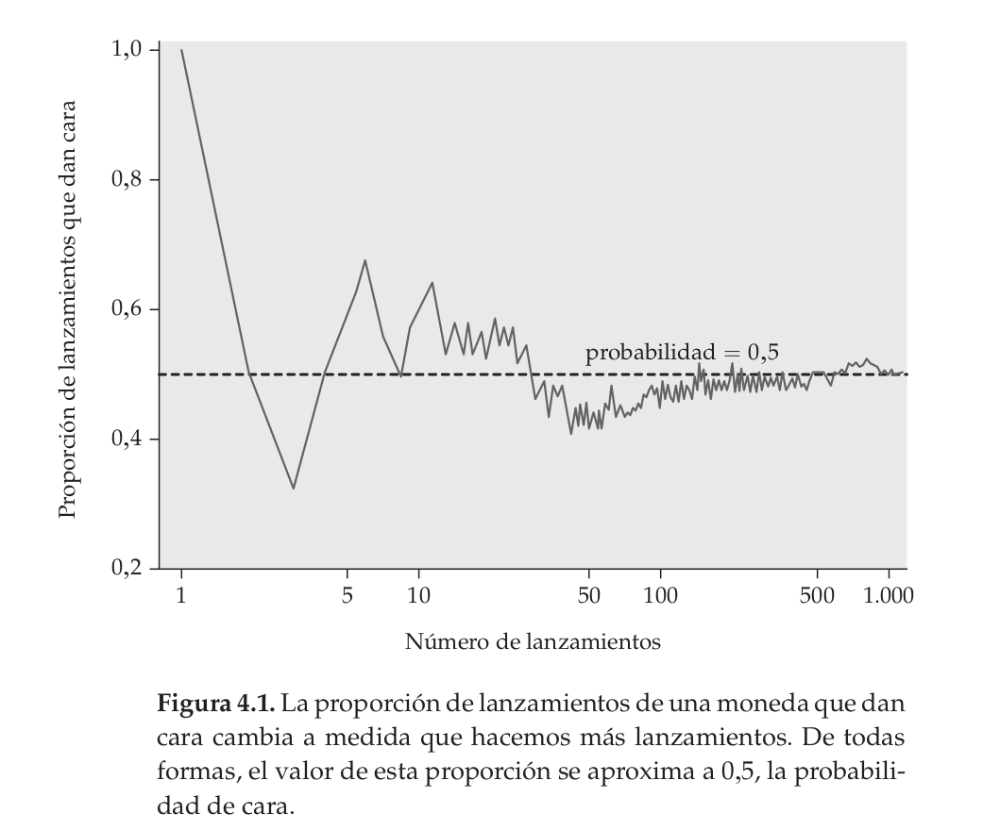
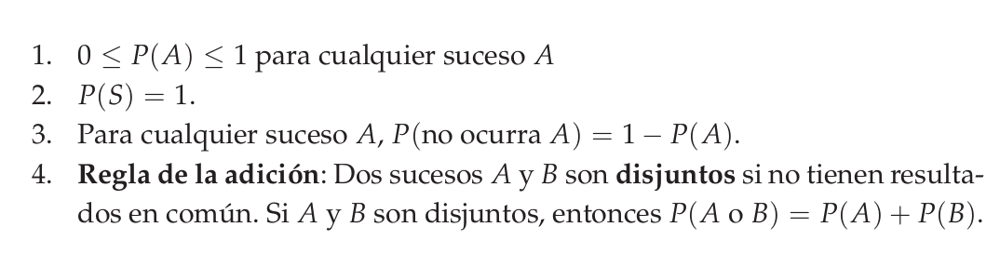
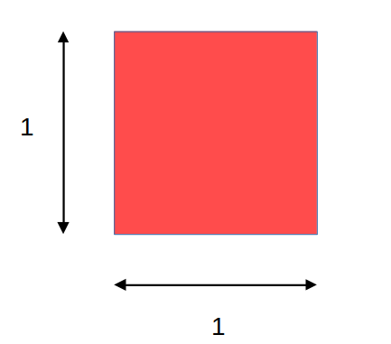
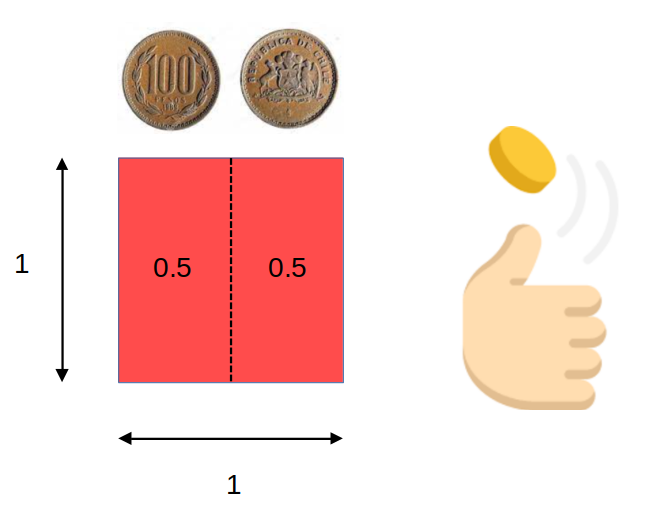
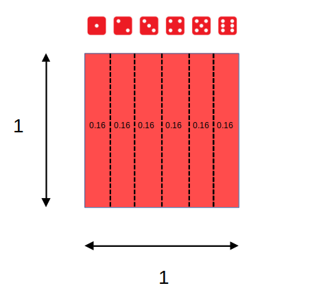
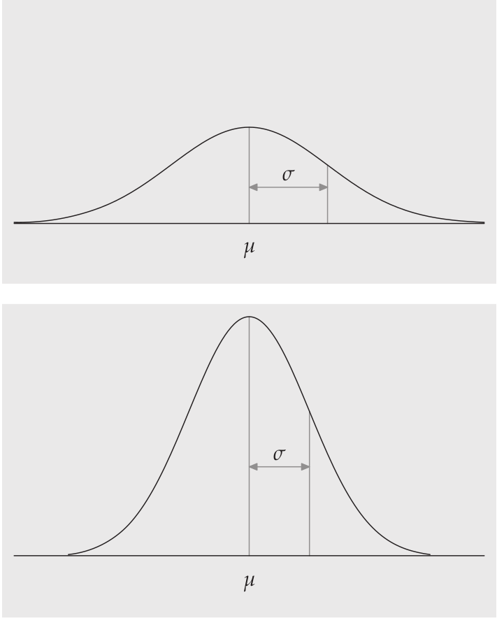
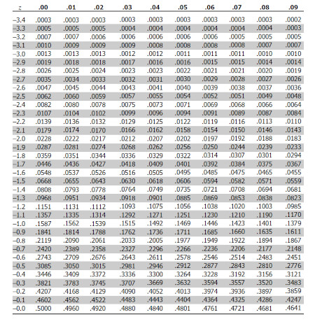
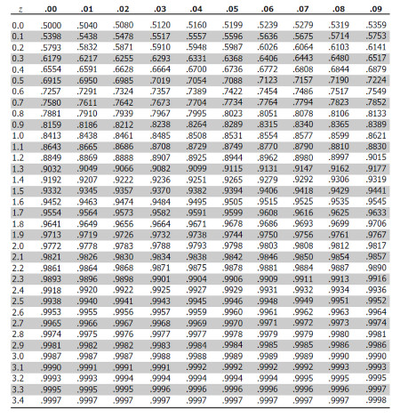

class: front


```{r setup, include=FALSE, cache = FALSE}
library(knitr)
opts_chunk$set(warning=FALSE,
             message=FALSE,
             echo=TRUE,
             comment = "",
             cache = FALSE, fig.width=10, fig.height=8)
pacman::p_load(flipbookr, tidyverse, kableExtra)
```


```{r xaringanExtra, include=FALSE}
xaringanExtra::use_xaringan_extra(c("tile_view", "animate_css"))
xaringanExtra::use_scribble()
```

.pull-left-wide[
# Estadística Correlacional]

.pull-right-narrow[]

## Asociación, inferencia y reporte

----
.pull-left[

## Juan Carlos Castillo
## Sociología FACSO - UChile
## 2do Sem 2023 
## [.orange[correlacional.netlify.com]](https:/correlacional.netlify.com)
]


.pull-right-narrow[
.center[
.content-block-gray[
## Sesión 5: 
## .orange[Introducción a la Inferencia Estadística]]
]
]

---

layout: true
class: animated, fadeIn

---
class: roja right

# .black[Contenidos]

.pull-left-narrow[
]

.pull-right-wide[

### .yellow[1- Resumen sesión anterior]

### 2- Inferencia y muestras

### 3- Aleatoridad y probabilidad

### 4- Curva normal y puntajes Z

]
---
.right[ # Resumen
]

- Reporte de correlación: además de reportar la intensidad y el sentido, acompañar reporte de tamaño de efecto y varianza compartida $R^2$ 

--

- Correlación de Spearman: apropiada para variables ordinales, equivale a la correlación de Pearson del ranking de las variables

--

- Matriz de correlaciones: forma tradicional de reporte de asociaciones de las variables de una investigación, importante considerar tratamiento de datos perdidos (listwise o pairwise)


---
class: roja right

# .black[Contenidos]

.pull-left-narrow[
]

.pull-right-wide[

### 1- Resumen sesión anterior

### .yellow[2- Inferencia y muestras]

### 3- Aleatoridad y probabilidad

### 4- Curva normal y puntajes Z

]

---
# Inferencia: la otra parte del análisis

Cuando se analizan datos, 2 cosas principales

.pull-left[
.content-box-yellow[
- cálculo del estadístico:

  - promedio

  - desviación estándar

  - correlación
  
  - ...
]
]

.pull-right[
.content-box-red[
- inferencia: ¿existe este estadístico en la población?

  - probabilidad
  
  - error
  
  - significación
  
]
]
---


---
class: middle
# Motivación: 


[](https://observatorio.ministeriodesarrollosocial.gob.cl/storage/docs/casen/2022/Presentacion%20de%20resultados%20Casen%202022.pdf)
---

.pull-left-narrow[
# Inferencia
]


.pull-right-wide[
¿En qué medida se pueden relacionar resultados que se encuentran en un .green[(sub)conjunto de unidades] con lo que ocurre .red[en general]?]

--

.pull-right-wide[
Ej: si en un subconjunto de la población encuentro que el promedio de matemáticas es mayor en mujeres que en hombres ¿es esto un .orange[reflejo] de lo que ocurre en general, o se debe solo al .red[azar]? ¿se puede .green[extrapolar] a la poblacion?
]

???

mapa y territorio, Borges
lidiando con el caos y la incertidumbre
la domesticación de la casualidad
error

---
background-image: url("https://images.rawpixel.com/image_800/cHJpdmF0ZS9sci9pbWFnZXMvd2Vic2l0ZS8yMDIyLTEyL3JtNjE0LWotYmctMDA4LmpwZw.jpg")
background-size: cover


.medium[En aquel Imperio, el Arte de la Cartografía logró tal Perfección que el mapa de una sola Provincia ocupaba toda una Ciudad, y el mapa del Imperio, toda una Provincia. Con el tiempo, estos Mapas Desmesurados no satisficieron y los Colegios de Cartógrafos levantaron un Mapa del Imperio, que tenía el tamaño del Imperio y coincidía puntualmente con él.

Menos Adictas al Estudio de la Cartografía, las Generaciones Siguientes entendieron que ese dilatado Mapa era Inútil y no sin Impiedad lo entregaron a las Inclemencias del Sol y los Inviernos. En los desiertos del Oeste perduran despedazadas Ruinas del Mapa, habitadas por Animales y por Mendigos; en todo el País no hay otra reliquia de las Disciplinas Geográficas.]

.small[Suárez Miranda, Viajes de Varones Prudentes, Libro Cuarto, Cap. XLV, Lérida, 1658.]

--

.right[Borges -  Del Rigor de la Ciencia]


---
.pull-left-narrow[


]
.pull-right-wide[

## Conceptos claves de inferencia
- La **inferencia** en estadística se refiere a la relación que existe entre los resultados obtenidos basados en nuestra muestra y la población

{{content}}

]

--

- **¿En qué medida podemos hacer inferencias desde nuestra muestra a la población?**

{{content}}

--

- Un concepto central es la probabilidad de **ERROR**


---
# Parámetros y estadísticos

----

|                     	| Población (parámetro)  	| Muestra (estadístico)  	|
|---------------------	|------------	|---------	|
| Promedio            	|  $\mu$           	|   $\bar{x}$           	|
| Varianza            	|        $\sigma²$      	|  $s²$                  	|
| Desviación estándar 	|        $\sigma$        	| $s$                    	|
| Correlación 	|        $\rho$        	| $r$                    	|


---
# Muestreo y variabilidad

¿Cómo es posible que la media x̄ obtenida a partir de una muestra de unos pocos hogares de todos los del país, pueda ser una estimación precisa de µ?

Una segunda muestra aleatoria obtenida en el mismo momento estaría
formada por hogares distintos y, sin duda, daría un valor distinto de x̄

---
# Muestreo y variabilidad

**Variabilidad muestral**: el valor de un estadístico varía en un muestreo aleatorio repetido

¿Cuánto varía? 

¿En qué rangos?

¿Qué tan **probable** es el rango de variación?

¿Es un rango aceptable en términos de investigación social?

---
class: roja right

# .black[Contenidos]

.pull-left-narrow[
]

.pull-right-wide[

### 1- Resumen sesión anterior

### 2- Inferencia y muestras

### 3- .yellow[Aleatoridad y probabilidad]

### 4- Curva normal y puntajes Z

]

---
.center[

]

---
# Aleatoriedad y probabilidad
----

.pull-left[
.content-box-red[
Llamamos a un fenómeno **aleatorio** si los resultados individuales son inciertos y, sin embargo, existe una **distribución regular** de los resultados después de un gran número de repeticiones.]
]

--

.pull-right[
.content-box-green[
La probabilidad de cualquier resultado de un fenómeno aleatorio es la **proporción de veces**  que el resultado se da después de una larga serie de
repeticiones

]]

---


.pull-left-narrow[
# Azar y repetición
El comportamiento del azar es impredecible con pocas repeticiones pero presenta un comportamiento regular y predecible con muchas repeticiones.
]

.pull-right-wide[

]
---
class: middle

# (Dato freak)

.pull-left[
Cerca del año 1900, el estadístico inglés Karl Pearson lanzó al aire una moneda **24.000** veces. El resultado: 12.012 caras, una proporción de 0,5005.]

.pull-right[


]


---
# Dados

Tenemos 1 dado, cuál es la probabilidad de que salga 3 al lanzarlo?

- Espacio muestral S= conjunto de todos los resultados posibles

$$S=\{1,2,3,4,5,6\}$$

- N del espacio muestral= 6 sucesos posibles

- Probabilidad de que salga 3 al tirar el dado= 
$\frac{1}{6}=0.166$

---
class: inverse middle right

Un **modelo de probabilidad** para un fenómeno aleatorio consiste en un espacio muestral S y una asignación de probabilidades P.

El **espacio muestral $S$** es el conjunto de todos los resultados posibles de un fenómeno aleatorio. 

Un **suceso** es un conjunto de resultados. P asigna un número P(A) a un suceso A como su probabilidad.

---
# Reglas modelo de probabilidad




---

# [Dados, probabilidades y distribuciones](https://academo.org/demos/dice-roll-statistics/)

----
.pull-left[

]

.pull-right[
Ejercicio:
  
  - probar lanzando 1 dado repetidas veces

  - probar con 2 dados
  
  - ... y con 6

-> [link](https://academo.org/demos/dice-roll-statistics/)
]

---
# Dados, probabilidades y áreas
.center[

]
---
# Dados, probabilidades y áreas
.center[

]
---
# Dados, probabilidades y áreas
.center[

]
---
# Dados, probabilidades y áreas

.pull-left[

]

.pull-right[
<br>
 Eventos posibles (espacio muestral S) = 6 = (1,2,3,4,5,6)


\begin{align*}
P(x)\geq4&=P(4)+P(5)+P(6) \\
&=0.1\overline{6}+0.1\overline{6}+0.1\overline{6} \\
&=0.5
\end{align*}
]

---
# Sucesos con distinta probabilidad

Ej: suma de 3 dados al azar repetidos
.center[

]

---

.pull-left[
## Histograma
Frecuencias o probabilidad de cada evento

```{r echo=FALSE}
#make this example reproducible
set.seed(0)

#define data
data <- data.frame(x=rnorm(1000))

#create histogram and overlay normal curve
ggplot(data, aes(x)) +
  geom_histogram(aes(y = ..density..), fill='lightgray', col='black')

```

]

.pull-right[
## Curvas de densidad

Modelo matemático de la distribución

```{r echo=FALSE}
#make this example reproducible
set.seed(0)

#define data
data <- data.frame(x=rnorm(1000))

#create histogram and overlay normal curve
ggplot(data, aes(x)) +
  geom_histogram(aes(y = ..density..), fill='lightgray', col='black')+
    stat_function(fun = dnorm, args = list(mean=mean(data$x), sd=sd(data$x)))

```


]

---

# Curva de densidad

.pull-left[
.medium[
- describe el aspecto general de una distribución

- se halla siempre en el eje de las abscisas o por encima de él, y define por debajo un área exactamente igual a 1.

- El área por debajo de la curva, y entre cualquier intervalo de valores, es la proporción de todas las observaciones que están situadas en dicho intervalo.]
]

.pull-right[

```{r echo=FALSE}
#make this example reproducible
set.seed(0)

#define data
data <- data.frame(x=rnorm(1000))

#create histogram and overlay normal curve
ggplot(data, aes(x)) +
  geom_histogram(aes(y = ..density..), fill='lightgray', col='black')+
    stat_function(fun = dnorm, args = list(mean=mean(data$x), sd=sd(data$x)))

```

]

---
class: roja right

# .black[Contenidos]

.pull-left-narrow[
]

.pull-right-wide[

### 1- Resumen sesión anterior

### 2- Inferencia y muestras

### 3- Aleatoridad y probabilidad

### .yellow[4- Curva normal y puntajes Z]

]

---
background-image: url("img/normal.png")
background-size: cover
# Distribuciones normales

- clase particular de curvas de densidad

- simétricas y con un solo punto de elevación

- la media se sitúa al centro, y la desviación estandar expresa su dispersión

- la pendiente es más fuerte cerca del centro, y se suaviza hacia los extremos

- Los puntos en los que tiene lugar este cambio de curvatura se hallan a una distancia σ, a ambos lados de la media µ.

---
.center[

]
---
# ¿Por qué son importantes las distribuciones normales en estadística?

- las distribuciones normales son buenas descripciones de algunas distribuciones de datos reales

- buenas aproximaciones a los resultados de muchos tipos de fenómenos aleatorios (ej: lanzar dados)

- permiten realizar **inferencia estadística** sobre fenómenos basados en distribuciones normales

---
class: inverse bottom right

## Relación entre áreas bajo la curva normal y probabilidades


---
# Regla del 68-95-99,7

En una distribución normal de media $\mu$ y desviación estándar $\sigma$:

- El **68%** de todas las observaciones se encuentran dentro del
intervalo µ ± σ.

- El **95%** de todas las observaciones se encuentran dentro del
intervalo µ ± 2σ.

- El **99,7%** de todas las observaciones se encuentran dentro del in-
tervalo µ ± 3σ.

---


---

**Ejemplo**:

Estatura promedio mujeres en Chile: 160 cm
Desviación estándar: 5 cm

¿Qué podemos decir basándonos en la distribución normal?

--

- el 68% de las mujeres se encuentra entre 155 y 165cm

- el 95% de las mujeres se encuentra entre 150 y 170cm

- solo un 5% de las mujeres mide más de 170cm
- prácticamente todas las mujeres (99.7) se encuentran entre 145 y 175cm


---
# Valores $z$ y estandarización

- estandarización: expresar el valor de una distribución en términos de desviaciones estándar basados en la distribución normal

- para estandarizar un valor, se le resta la media y se divide por la desviación estándar


$$z=\frac{x-\mu}{\sigma}$$

- los valores estandarizados se denominan .red[valores z]

---
# Valores $z$ y estandarización

- Un valor z nos dice a cuántas desviaciones típicas se encuentra la observación original de la media y en qué dirección.

- Las observaciones mayores que la media son positivas y las menores, negativas.

---
Siguiendo con el ejemplo anterior de estatura de mujeres $\bar{x}=160$ y $\sigma=5$, la estatura estandarizada es:

$$z=\frac{altura-160}{5}  $$

Por ejemplo, una mujer que mide 165:

$$z=\frac{165-160}{5}=\frac{5}{5}=1$$

Su puntaje $z$ nos dice que está una desviación estandar sobre el promedio
---
# Puntajes $z$ y proporciones 
.pull-left[
Los valores $z$ permiten calcular la proporción de casos bajo la curva normal que están sobre y bajo el puntaje

Por ejemplo, para el caso de 1 desviación sobre el promedio, el área bajo la curva bajo este puntaje sería:

]

.pull-right[

```{r echo=FALSE}
# import ggplot
library(ggplot2)

# x-axis and y-axis for the pdf line
x <- seq(-4,4,0.01)
y <- dnorm(x)

# x-axis and y-axis for shaded area
x_shaded<- seq(-4, 1, 0.01)
y_shaded <- c(dnorm(x_shaded),0)
x_shaded<-c(x_shaded,1)

# plot it, alpha sets the level of transparency in color
ggplot() + geom_line(aes(x, y))+geom_polygon(data = data.frame(x=x_shaded, y=y_shaded), aes(x_shaded, y_shaded),fill = "red",alpha = 1/5)+
theme(panel.background = element_rect(fill='transparent'),
  axis.line.x = element_line(color="black", size = 0.5),
  axis.line.y = element_line(color="black", size = 0.5)) +
  scale_x_continuous(n.breaks=8) + 
  theme(text = element_text(size = 20)) 
```
]


---
class: middle

.pull-left-wide[
<br>
<br>

]

.pull-right-narrow[
.medium[
<br>
<br>
<br>
En base a la distribución normal sabemos que bajo 1 desviación estańdar está el 68% de los datos + la cola izquierda de la curva, que es (100-68/2)=16%.

Por lo tanto 84% (68+16) de los casos tienen una estatura menor a 165 cm
]]
---
.pull-left[
- Ej: estatura de 152cm

\begin{align*}
z&=\frac{x-\mu}{\sigma}\\\\
z&=\frac{altura-160}{5}\\\\
z&=\frac{152-160}{5}=\frac{-8}{5}=-1.6
\end{align*}
]

.pull-right[

```{r echo=FALSE}
# x-axis and y-axis for shaded area
x_shaded<- seq(-4, -1.6, 0.01)
y_shaded <- c(dnorm(x_shaded),0)
x_shaded<-c(x_shaded,-1.6)

# plot it, alpha sets the level of transparency in color
ggplot() + geom_line(aes(x, y))+geom_polygon(data = data.frame(x=x_shaded, y=y_shaded), aes(x_shaded, y_shaded),fill = "red",alpha = 1/5)+
theme(panel.background = element_rect(fill='transparent'),
  axis.line.x = element_line(color="black", size = 0.5),
  axis.line.y = element_line(color="black", size = 0.5)) +
  scale_x_continuous(n.breaks=8) + 
  theme(text = element_text(size = 20)) 

```

¿Cómo calcular el área bajo la curva para un valor específico?
]


---
# Tabla de Puntajes Z

.pull-left[

]

.pull-right[

]

---
# Tabla de Puntajes Z

.pull-left[
- El valor correspondiente a -1.6 en la tabla de valores Z se busca en la fila Z -1.6 y la columna 0.00 (ya que la centésima de -1.6 es 0).

- = 0.0548, es decir, alrededor de un 5% de los casos se enceuntra bajo esa estatura (152 cm)
]

.pull-right[
- en R= 

```{r}
pnorm(q=-1.6)
```

]

---
class: inverse

##Resumen

- inferencia: ¿con qué probabilidad podemos decir que lo que calculamos en nuestra muestra existe en la población?

- probabilidades y distribución normal

- puntajes Z y área bajo la curva normal


---
class: inverse

## Próxima semana: Distribuciones muestrales, error estándar e intervalos de confianza

- ¿Qué tan probable es que un resultado obtenido en una muestra se deba al azar?

- ¿Cómo nos sirve la curva normal para contrastar hipótesis de investigación?

- ¿Con qué nivel de confianza podemos afirmar que nuestra hipótesis es verdadera?


---
# Lectura:


[Moore cap. 6 - Introducción a la inferencia estadística](https://correlacional.netlify.app/files/textos/Moore.pdf)

---

# ASISTENCIA

.pull-left[


]

.pull-right[
<br>
<br>
<br>
<br>
<br>
bit.ly/correlacional-asistencia
]


---
class: front

.pull-left-wide[
# Estadística Correlacional]

.pull-right-narrow[]

## Asociación, inferencia y reporte

----
.pull-left[

## Juan Carlos Castillo
## Sociología FACSO - UChile
## 2do Sem 2023 
## [.orange[correlacional.netlify.com]](https://encuestas-sociales.netlify.com)
]
    

