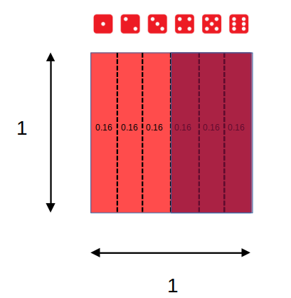
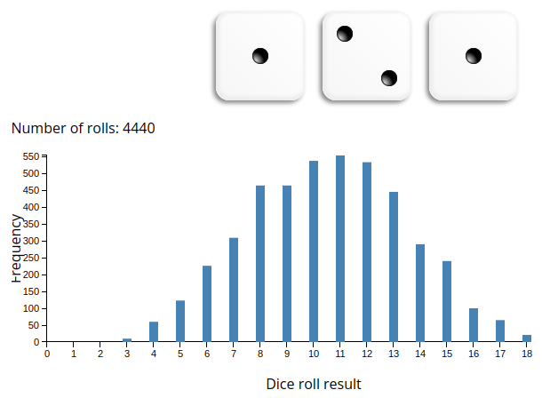
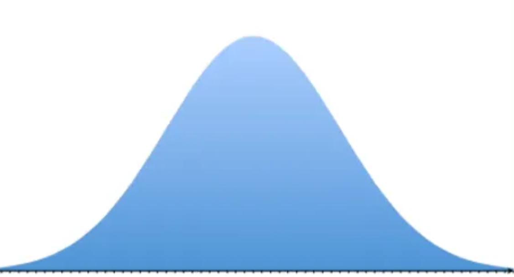
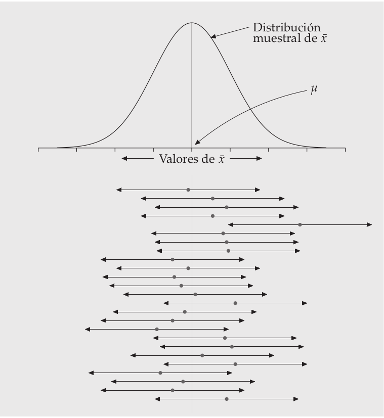

class: front


```{r setup, include=FALSE, cache = FALSE}
library(knitr)
opts_chunk$set(warning=FALSE,
             message=FALSE,
             echo=TRUE,
             comment = "",
             cache = FALSE, fig.width=10, fig.height=8)
pacman::p_load(flipbookr, tidyverse, kableExtra)
```


```{r xaringanExtra, include=FALSE}
xaringanExtra::use_xaringan_extra(c("tile_view", "animate_css"))
xaringanExtra::use_scribble()
```

.pull-left-wide[
# Estadística Correlacional]

.pull-right-narrow[]

## Asociación, inferencia y reporte

----
.pull-left[

## Juan Carlos Castillo
## Sociología FACSO - UChile
## 2do Sem 2023 
## [.orange[correlacional.netlify.com]](https:/correlacional.netlify.com)
]


.pull-right-narrow[
.center[
.content-block-gray[
## Sesión 6: 
## .orange[Inferencia 2:  Error e intervalos de confianza]]
]
]

---

layout: true
class: animated, fadeIn

---
class: roja right
 
.pull-left-narrow[
# .black[Contenidos]
]

.pull-right-wide[

## .yellow[1- Resumen sesión anterior]
## 2- Distribución muestral del promedio
## 3- Error estándar
## 4- Intervalos de confianza
]

---
# Inferencia: la otra parte del análisis

Cuando se analizan datos, 2 cosas principales

.pull-left[
.content-box-yellow[
- cálculo del estadístico:

  - promedio

  - desviación estándar

  - correlación
  
  - ...
]
]

.pull-right[
.content-box-red[
- inferencia: ¿existe este estadístico en la población?

  - probabilidad
  
  - error
  
  - significación
  
]
]

---
# Parámetros y estadísticos

----

|                     	| Población (parámetro)  	| Muestra (estadístico)  	|
|---------------------	|------------	|---------	|
| Promedio            	|  $\mu$           	|   $\bar{x}$           	|
| Varianza            	|        $\sigma²$      	|  $s²$                  	|
| Desviación estándar 	|        $\sigma$        	| $s$                    	|
| Correlación 	|        $\rho$        	| $r$                    	|


---
# Muestreo y variabilidad

¿Cómo es posible que la media x̄ obtenida a partir de una muestra de unos pocos hogares de todos los del país, pueda ser una estimación precisa de µ?

Una segunda muestra aleatoria obtenida en el mismo momento estaría
formada por hogares distintos y, sin duda, daría un valor distinto de x̄

Por lo tanto: ¿cómo podemos .red[confiar] en los estadísticos de una muestra?

---
# Muestreo y variabilidad

**Variabilidad muestral**: el valor de un estadístico varía en un muestreo aleatorio repetido

¿Cuánto varía? 

¿En qué rangos?

¿Qué tan **probable** es el rango de variación?

¿Es un rango aceptable en términos de investigación social?

---
# Dados, probabilidades y áreas

.pull-left[

]

.pull-right[
<br>
 Eventos posibles (espacio muestral S) = 6 = (1,2,3,4,5,6)


\begin{align*}
P(x)\geq4&=P(4)+P(5)+P(6) \\
&=0.1\overline{6}+0.1\overline{6}+0.1\overline{6} \\
&=0.5
\end{align*}
]

---
# Sucesos con distinta probabilidad

Ej: suma de 3 dados al azar repetidos
.center[

]

---

.pull-left[
## Histograma
Frecuencias o probabilidad de cada evento

```{r echo=FALSE}
#make this example reproducible
set.seed(0)

#define data
data <- data.frame(x=rnorm(1000))

#create histogram and overlay normal curve
ggplot(data, aes(x)) +
  geom_histogram(aes(y = ..density..), fill='lightgray', col='black')

```

]

.pull-right[
## Curvas de densidad

Modelo matemático de la distribución

```{r echo=FALSE}
#make this example reproducible
set.seed(0)

#define data
data <- data.frame(x=rnorm(1000))

#create histogram and overlay normal curve
ggplot(data, aes(x)) +
  geom_histogram(aes(y = ..density..), fill='lightgray', col='black')+
    stat_function(fun = dnorm, args = list(mean=mean(data$x), sd=sd(data$x)))

```


]

---
# ¿Por qué son importantes las distribuciones normales en estadística?

- las distribuciones normales son buenas descripciones de algunas distribuciones de datos reales

- permiten realizar **inferencia estadística** sobre la probabilidad de ocurrencia de ciertos fenómenos basados en distribuciones normales

---
## Distribución normal estándar


---
# Valores $z$ y estandarización

- estandarización: expresar el valor de una distribución en términos de desviaciones estándar basados en la distribución normal

- para estandarizar un valor, se le resta la media y se divide por la desviación estándar


$$z=\frac{x-\mu}{\sigma}$$

- los valores estandarizados se denominan .red[valores z]

---
# Puntajes $z$ y proporciones 
.pull-left[
Los valores $z$ permiten calcular la proporción de casos bajo la curva normal que están sobre y bajo el puntaje

Por ejemplo, para el caso de 1 desviación sobre el promedio, el área bajo la curva bajo este puntaje sería:

]

.pull-right[

```{r echo=FALSE}
# import ggplot
library(ggplot2)

# x-axis and y-axis for the pdf line
x <- seq(-4,4,0.01)
y <- dnorm(x)

# x-axis and y-axis for shaded area
x_shaded<- seq(-4, 1, 0.01)
y_shaded <- c(dnorm(x_shaded),0)
x_shaded<-c(x_shaded,1)

# plot it, alpha sets the level of transparency in color
ggplot() + geom_line(aes(x, y))+geom_polygon(data = data.frame(x=x_shaded, y=y_shaded), aes(x_shaded, y_shaded),fill = "red",alpha = 1/5)+
theme(panel.background = element_rect(fill='transparent'),
  axis.line.x = element_line(color="black", size = 0.5),
  axis.line.y = element_line(color="black", size = 0.5)) +
  scale_x_continuous(n.breaks=8) + 
  theme(text = element_text(size = 20)) 
```
]


---
class: middle

.pull-left[
## Curva normal, puntajes Z y proporciones

]

.pull-right[
.medium[
<br>
<br>
<br>
Siguiendo con el ejemplo de altura $\bar{x}=160,\sigma=5$

$$z=\frac{x-\mu}{\sigma}=\frac{165-160}{5}=1$$

En base a la distribución normal sabemos que bajo 1 desviación estańdar está el 68% de los datos + la cola izquierda de la curva, que es (100-68/2)=16%.

Ej:  84% (68+16) de los casos tienen una estatura menor a 165 cm
]]


---
class: roja right
 
.pull-left-narrow[
# .black[Contenidos]
]

.pull-right-wide[

## 1- Resumen sesión anterior
## .yellow[2- Distribución muestral del promedio]
## 3- Error estándar
## 4- Intervalos de confianza
]


---

# Inferencia

¿En qué medida se pueden relacionar resultados que se encuentran en una .green[muestra] (subconjunto de unidades) con lo que ocurre .red[en general]?

--
.medium[
- Ej: si en un subconjunto de la población encuentro que el promedio de matemáticas es mayor en mujeres que en hombres ¿se puede .green[extrapolar] a la población, o se debe solo al .red[azar]?
]

--
.content-box-red[
.center[
-> .red[¿Bajo qué normas o reglas estoy dispuest_ a .green[confiar] en que lo que obtuve con mi muestra (ej: un promedio) ocurre efectivamente en la población?]]]

???

¿le creo o no le creo al promedio de una muestra? ¿qué tendría que pasar para que le creyera?

mapa y territorio, Borges
lidiando con el caos y la incertidumbre
la domesticación de la casualidad
error

---
# Principios de la ciencia (Merton)

- **Universalismo**: cualquier persona puede contribuir al conocimiento científico, independiente de su origen.

- **Desinterés**: la conducta de investigadores debe estar orientada por la búsqueda de la verdad, no con intereses personales ni monetarios.

- **Comunalidad**: los hallazgos de la ciencia pertenecen a la comunidad y no a quién los descubrió.

- .red[**Escepticismo organizado**: los hallazgos no se aceptan porque sí, se requieren pruebas.]

---
class: roja

# ¿Qué .yellow[pruebas] se requieren para que se pueda .orange[confiar] en que un resultado obtenido con una muestra ocurra en la población?


---
# Ejercicio

- tenemos una población de (ej.) 200

- en esta población existen 6 niveles educacionales, homogéneamente distribuidos (cada nivel educacional equivale a a 1/6 de la población)

- por lo tanto, el nivel educacional promedio de la población equivale a 1+2+3+4+5+6/6= 3.5

---
# Ejercicio: Muestra aleatoria y error

- cada persona selecciona al azar a 5 sujetos (5 dados) y les "pregunta" su nivel educacional (cara superior del dado luego de tirarlo)

- sacar el promedio de cada muestra

- ¿qué tanto varían los promedios?

-> registro [aquí](https://docs.google.com/spreadsheets/d/1YrMd_ds5zHgQWrdjYcX5Diwv7bQHDzf5r2A0oYWriyA/edit#gid=0)


???

---
# Distribución muestral del promedio

.pull-left-narrow[

]

.pull-right-wide[
- Si tengo la desviación estándar de los promedios, puedo construir un .red[intervalo] de probabilidad, basado en la curva normal

- En lenguaje de inferencia no digo que mi promedio es=10, sino un rango (intervalo) y un cierto nivel de probabilidad
]

---
class: roja

## .yellow[Problema: tenemos 1 SOLA MUESTRA, y un solo promedio]

# ¿Cómo obtenemos entonces la desviación estándar del promedio?

---
class: roja right
 
.pull-left-narrow[
# .black[Contenidos]
]

.pull-right-wide[

## 1- Resumen sesión anterior
## 2- Distribución muestral del promedio
## .yellow[3- Error estándar]
## 4- Intervalos de confianza
]


---

.pull-left-narrow[


]

.pull-right-wide[
.content-box-purple[

## Desviación estándar y error estándar]
- más que el promedio de la variable en nuestra **muestra**, en inferencia nos interesa estimar en qué medida ese promedio da cuenta del promedio de la **población**

{{content}}

]

--

- contamos con **una muestra**, pero sabemos que otras muestras podrían haber sido extraídas, probablemente con distintos resultados.

---
# Distribución muestral del promedio


---
# Distribución muestral del promedio


---
# Distribución muestral del promedio


---
# Teorema del límite central

- la distribución de los promedios de distintas muestras - o .red[distribución muestral del promedio] - se aproxima a una distribución normal

--

- En muestras mayores a 30 la desviación estándar de los promedios (error estándar del promedio) equivale a:
$$\sigma_{\bar{X}}=SE(error estándar)=\frac{s}{\sqrt{N}}$$
  - $s$ = desviación estándar de la muestra
  - $N$ = tamaño de la muestra

---
class: inverse

## Basados en el teorema del límite central, es posible calcular la desviación estándar del promedio (error estándar) con .red[una sola muestra]

-> ver demostración [aquí](https://docs.google.com/spreadsheets/d/1YrMd_ds5zHgQWrdjYcX5Diwv7bQHDzf5r2A0oYWriyA/edit#gid=0) 

---
class: inverse middle right

# ¿Para qué nos sirve el .red[error estándar] o .red[SE] del promedio?

##(... y de otros estadísticos, como la correlación)

---

# Usos del error estándar

- Dos usos complementarios:

  - construcción de intevalos de confianza

  - test de hipótesis (próxima clase)

---
class: roja right
 
.pull-left-narrow[
# .black[Contenidos]
]

.pull-right-wide[

## 1- Resumen sesión anterior
## 2- Distribución muestral del promedio
## 3- Error estándar
## .yellow[4- Intervalos de confianza]
]


---
# Intervalos y probabilidad

.pull-left-narrow[
.medium[

- Nuestro promedio muestral $\bar{x}$ posee una distribución normal con una desviación estandar = SE (error estándar)

- Esto nos permite estimar probabilidades basados en los valores de la curva normal

]
]
.pull-right-wide[
.center[]]

---
# Intervalos de confianza

.pull-left-wide[
.center[]]


.pull-right-narrow[
.medium[

- Por ejemplo, un intervalo de confianza de $\bar{x}\pm1.96SE$ abarca aproximadamente el 95% de los valores probables

- En este caso, puedo decir que el promedio se encuentra en un rango de valores con un .red[nivel de confianza] de 95%


]
]

---
## Ejemplo: intervalo de confianza para un promedio
----
.pull-left[
.content-box-green[
- Tenemos:

  - promedio de ingresos: 800.000
  
  - desviación estándar: 100.000
  
  - N muestral: 1.600
]]

.pull-right[

\begin{align*}
SE&=\frac{s}{\sqrt{N}} \\\\
&=\frac{100.000}{\sqrt{1.600}} \\\\
&=\frac{100.000}{40}=2.500
\end{align*}
]

---

- Entonces:

  - error estándar es $SE=2.500$, 
  - promedio $\bar{x}=800.000$

- Con estos valores podemos construir un rango de probabilidad basado en la curva normal, sumando y restando errores estándar

- Por ejemplo, $\bar{x}{\color{red}\pm}1.96SE$ abarcan aproximadamente el 95% de los valores alrededor del promedio

- Por lo tanto, podemos decir que el promedio de ingresos se encuentra entre 797.500 y 802.500 .red[con un 95% de confianza] 

---

# ¿Confianza en qué?

- bajo esta lógica, la confianza está en que si tuvieramos la posibilidad de extraer múltiples muestras, el 95% de las veces nuestro intervalo contendría el promedio

- o que existe un 5% de probabilidad de error, es decir, que el promedio de la muestra no sea el de la población

- o que las chances de error son 1 de 20 

---
class: roja

# Un .yellow[intervalo de confianza] (IC o CI) es la mejor estimación del rango de un estadístico en la población (parámetro poblacional) con una muestra aleatoria

---
.center[

]
---
class: inverse middle


## ¿De qué depende el .red[tamaño] del intervalo de confianza?

## ¿Cómo se establece el .red[nivel de confianza] del intervalo?

---
## ¿De qué depende el tamaño del intervalo de confianza?

- recordemos que el intervalo de confianza se elabora sumando y restando errores estándar al promedio

$$\sigma_{\bar{X}}=SE(error estándar)=\frac{s}{\sqrt{N}}$$
--

- dado que el tamaño muestral (N) se encuentra en el denominador del $SE$, a mayor N, menor será el $SE$ y menor el intervalo de confianza

- esto tiene implicancias directas en el cálculo del tamaño muestral

---
# ¿De qué depende el nivel de confianza?

- en estadística inferencial, la confianza se asocia a un nivel de probabilidad de error

- la probabilidad de error a aceptar no es un criterio estadístico, es convencional

- por convención, se acepta como estadísticamente significativa una probabilidad de error menor al 5%, asociada a un intervalo de confianza de $\pm1.96SE$ (usando la distribución $Z$)

---
class: inverse


# Resumen

- distribución muestral del promedio

- error estándar

- intervalos de confianza

---
# Lectura:


[Moore cap. 7 - Inferencia para medias y desviaciones típicas](https://correlacional.netlify.app/files/textos/Moore.pdf)

# Recomendaciones


Ver [simulación de intervalo de confianza para promedio muestral](https://shiny.rit.albany.edu/stat/confidence/)


---

# ASISTENCIA

.pull-left[


]

.pull-right[
<br>
<br>
<br>
<br>
<br>
bit.ly/correlacional-asistencia
]


---
class: front

.pull-left-wide[
# Estadística Correlacional]

.pull-right-narrow[]

## Asociación, inferencia y reporte

----
.pull-left[

## Juan Carlos Castillo
## Sociología FACSO - UChile
## 2do Sem 2023 
## [.orange[correlacional.netlify.com]](https://encuestas-sociales.netlify.com)
]
    

