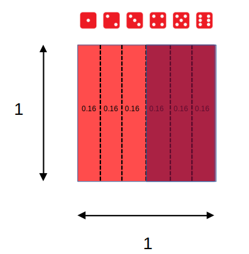
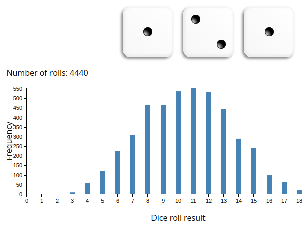
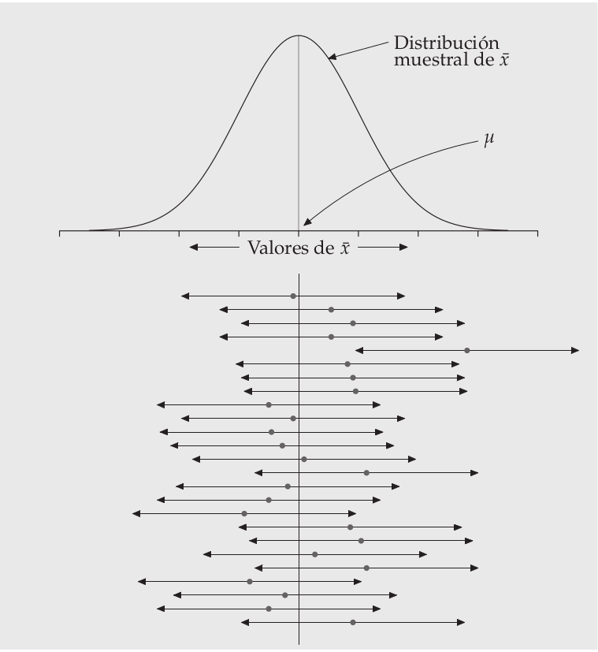

class: front


```{r setup, include=FALSE, cache = FALSE}
library(knitr)
opts_chunk$set(warning=FALSE,
             message=FALSE,
             echo=TRUE,
             comment = "",
             cache = FALSE, fig.width=10, fig.height=8)
pacman::p_load(flipbookr, tidyverse, kableExtra)
```


```{r xaringanExtra, include=FALSE}
xaringanExtra::use_xaringan_extra(c("tile_view", "animate_css"))
xaringanExtra::use_scribble()
```

.pull-left-wide[
# Estadística Correlacional]

.pull-right-narrow[]

## Asociación, inferencia y reporte

----
.pull-left[

## Juan Carlos Castillo
## Sociología FACSO - UChile
## 2do Sem 2023 
## [.orange[correlacional.netlify.com]](https:/correlacional.netlify.com)
]


.pull-right-narrow[
.center[
.content-block-gray[
## Sesión 6: 
## .orange[Inferencia 2:  Hipótesis y error]]
]
]

---

layout: true
class: animated, fadeIn

---
class: roja right
 
# .black[Contenidos]

.pull-left-narrow[
]
.pull-right-wide[

### .yellow[1- Resumen sesión anterior]

]


---
# Inferencia: la otra parte del análisis

Cuando se analizan datos, 2 cosas principales

.pull-left[
.content-box-yellow[
- cálculo del estadístico:

  - promedio

  - desviación estándar

  - correlación
  
  - ...
]
]

.pull-right[
.content-box-red[
- inferencia: ¿existe este estadístico en la población?

  - probabilidad
  
  - error
  
  - significación
  
]
]

---
# Parámetros y estadísticos

----

|                     	| Población (parámetro)  	| Muestra (estadístico)  	|
|---------------------	|------------	|---------	|
| Promedio            	|  $\mu$           	|   $\bar{x}$           	|
| Varianza            	|        $\sigma²$      	|  $s²$                  	|
| Desviación estándar 	|        $\sigma$        	| $s$                    	|
| Correlación 	|        $\rho$        	| $r$                    	|


---
# Muestreo y variabilidad

¿Cómo es posible que la media x̄ obtenida a partir de una muestra de unos pocos hogares de todos los del país, pueda ser una estimación precisa de µ?

Una segunda muestra aleatoria obtenida en el mismo momento estaría
formada por hogares distintos y, sin duda, daría un valor distinto de x̄

---
# Muestreo y variabilidad

**Variabilidad muestral**: el valor de un estadístico varía en un muestreo aleatorio repetido

¿Cuánto varía? 

¿En qué rangos?

¿Qué tan **probable** es el rango de variación?

¿Es un rango aceptable en términos de investigación social?

---
# Dados, probabilidades y áreas

.pull-left[

]

.pull-right[
<br>
 Eventos posibles (espacio muestral S) = 6 = (1,2,3,4,5,6)


\begin{align*}
P(x)\geq4&=P(4)+P(5)+P(6) \\
&=0.1\overline{6}+0.1\overline{6}+0.1\overline{6} \\
&=0.5
\end{align*}
]

---
# Sucesos con distinta probabilidad

Ej: suma de 3 dados al azar repetidos
.center[

]

---

.pull-left[
## Histograma
Frecuencias o probabilidad de cada evento

```{r echo=FALSE}
#make this example reproducible
set.seed(0)

#define data
data <- data.frame(x=rnorm(1000))

#create histogram and overlay normal curve
ggplot(data, aes(x)) +
  geom_histogram(aes(y = ..density..), fill='lightgray', col='black')

```

]

.pull-right[
## Curvas de densidad

Modelo matemático de la distribución

```{r echo=FALSE}
#make this example reproducible
set.seed(0)

#define data
data <- data.frame(x=rnorm(1000))

#create histogram and overlay normal curve
ggplot(data, aes(x)) +
  geom_histogram(aes(y = ..density..), fill='lightgray', col='black')+
    stat_function(fun = dnorm, args = list(mean=mean(data$x), sd=sd(data$x)))

```


]

---
# ¿Por qué son importantes las distribuciones normales en estadística?

- las distribuciones normales son buenas descripciones de algunas distribuciones de datos reales

- permiten realizar **inferencia estadística** sobre fenómenos basados en distribuciones normales

---
## Distribución normal estándar


---

**Ejemplo**:

Estatura promedio mujeres en Chile: 160 cm
Desviación estándar: 5 cm

¿Qué podemos decir basándonos en la distribución normal?

--

- el 68% de las mujeres se encuentra entre 155 y 165cm

- el 95% de las mujeres se encuentra entre 150 y 170cm

- solo un 5% de las mujeres mide más de 170cm
- prácticamente todas las mujeres (99.7) se encuentran entre 145 y 175cm


---
# Valores $z$ y estandarización

- estandarización: expresar el valor de una distribución en términos de desviaciones estándar basados en la distribución normal

- para estandarizar un valor, se le resta la media y se divide por la desviación estándar


$$z=\frac{x-\mu}{\sigma}$$

- los valores estandarizados se denominan .red[valores z]

---
# Puntajes $z$ y proporciones 
.pull-left[
Los valores $z$ permiten calcular la proporción de casos bajo la curva normal que están sobre y bajo el puntaje

Por ejemplo, para el caso de 1 desviación sobre el promedio, el área bajo la curva bajo este puntaje sería:

]

.pull-right[

```{r echo=FALSE}
# import ggplot
library(ggplot2)

# x-axis and y-axis for the pdf line
x <- seq(-4,4,0.01)
y <- dnorm(x)

# x-axis and y-axis for shaded area
x_shaded<- seq(-4, 1, 0.01)
y_shaded <- c(dnorm(x_shaded),0)
x_shaded<-c(x_shaded,1)

# plot it, alpha sets the level of transparency in color
ggplot() + geom_line(aes(x, y))+geom_polygon(data = data.frame(x=x_shaded, y=y_shaded), aes(x_shaded, y_shaded),fill = "red",alpha = 1/5)+
theme(panel.background = element_rect(fill='transparent'),
  axis.line.x = element_line(color="black", size = 0.5),
  axis.line.y = element_line(color="black", size = 0.5)) +
  scale_x_continuous(n.breaks=8) + 
  theme(text = element_text(size = 20)) 
```
]


---
class: middle

.pull-left[
## Curva normal, puntajes Z y proporciones

]

.pull-right[
.medium[
<br>
<br>
<br>
Siguiendo con el ejemplo de altura $\bar{x}=160,\sigma=5$

$$z=\frac{x-\mu}{\sigma}=\frac{165-160}{5}=1$$

En base a la distribución normal sabemos que bajo 1 desviación estańdar está el 68% de los datos + la cola izquierda de la curva, que es (100-68/2)=16%.

Ej:  84% (68+16) de los casos tienen una estatura menor a 165 cm
]]
---
.pull-left[
- Ej: estatura de 152cm

\begin{align*}
z&=\frac{x-\mu}{\sigma}\\\\
z&=\frac{altura-160}{5}\\\\
z&=\frac{152-160}{5}=\frac{-8}{5}=-1.6
\end{align*}
]

.pull-right[

```{r echo=FALSE}
# x-axis and y-axis for shaded area
x_shaded<- seq(-4, -1.6, 0.01)
y_shaded <- c(dnorm(x_shaded),0)
x_shaded<-c(x_shaded,-1.6)

# plot it, alpha sets the level of transparency in color
ggplot() + geom_line(aes(x, y))+geom_polygon(data = data.frame(x=x_shaded, y=y_shaded), aes(x_shaded, y_shaded),fill = "red",alpha = 1/5)+
theme(panel.background = element_rect(fill='transparent'),
  axis.line.x = element_line(color="black", size = 0.5),
  axis.line.y = element_line(color="black", size = 0.5)) +
  scale_x_continuous(n.breaks=8) + 
  theme(text = element_text(size = 20)) 

```

¿Cómo calcular el área bajo la curva para un valor específico?
]


---
# Tabla de Puntajes Z

.pull-left[
- El valor correspondiente a -1.6 en la tabla de valores Z se busca en la fila Z -1.6 y la columna 0.00 (ya que la centésima de -1.6 es 0).

- = 0.0548, es decir, alrededor de un 5% de los casos se enceuntra bajo esa estatura (152 cm)
]

.pull-right[
- Directamente en R= 

```{r}
pnorm(q=-1.6)
```

]

---
class: inverse

## Resumen sesión anterior

- inferencia: ¿con qué probabilidad podemos decir que lo que calculamos en nuestra muestra existe en la población?

- probabilidades y distribución normal

- puntajes Z y área bajo la curva normal


---
class: inverse

## Hoy: Distribuciones muestrales, error estándar e intervalos de confianza

- ¿Qué tan probable es que un resultado obtenido en una muestra se deba al azar?

- ¿Cómo nos sirve la curva normal para contrastar hipótesis de investigación?

- ¿Con qué nivel de confianza podemos afirmar que nuestra hipótesis es verdadera?

---

# Principios de la ciencia (Merton)


---

# LLAMADO AL ESCEPTISISMO (organizado con ciertas normas)

---

# Inferencia

¿En qué medida se pueden relacionar resultados que se encuentran en una .green[muestra[ (subconjunto de unidades) con lo que ocurre .red[en general]?

--
.medium[
- Ej: si en un subconjunto de la población encuentro que el promedio de matemáticas es mayor en mujeres que en hombres ¿se puede .green[extrapolar] a la poblacion, o se debe solo al .red[azar]?
]

--
.content-box-red[
.center[
-> .red[¿Bajo qué normas o reglas estoy dispuest_ a aceptar que lo que obtuve con mi muestra (ej: un promedio) ocurre efectivamente en la población?]]]
???

¿le creo o no le creo al promedio de una muestra? ¿qué tendría que pasar para que le creyera?

mapa y territorio, Borges
lidiando con el caos y la incertidumbre
la domesticación de la casualidad
error

---
# Ejercicio

- tenemos una población de (ej.) 200

- en esta población existen 6 niveles educacionales, homogéneamente distribuidos (cada nivel educacional equivale a a 1/6 de la población)

- por lo tanto, el nivel educacional promedio de la población equivale a 1+2+3+4+5+6/6= 3.5

---
# Ejercicio: Muestra aleatoria y error

- cada persona selecciona al azar a 5 sujetos (5 dados) y les "pregunta" su nivel educacional (cara superior del dado luego de tirarlo)

- sacar el promedio de cada muestra

- ¿qué tanto varían los promedios?


???

registrar en: 
https://docs.google.com/spreadsheets/d/1YrMd_ds5zHgQWrdjYcX5Diwv7bQHDzf5r2A0oYWriyA/edit#gid=0

evtl: llamar desde R y plotear los promedios

---
class: roja middle center

# ¿Para qué nos sirve la desviación estándar de los promedios de las disintas muestras?


---

.pull-left-narrow[
(curva normal)
]

.pull-right-wide[
- Si tengo la desviación estándar de los promedios puedo construir un .red[intervalo] de probabilidad, basado en la curva normal

- En lenguaje de inferencia no digo que mi promedio es=10, sino un rango (intervalo) y un cierto nivel de probabilidad


]

---
class: roja

## Problema: tenemos 1 SOLA MUESTRA, y un solo promedio

# ¿Cómo obtenemos entonces la desviación estándar del promedio?

---

.pull-left-narrow[


]

.pull-right-wide[
.content-box-purple[

## Desviación estándar y error estándar]
- más que el promedio de la variable en nuestra **muestra**, en inferencia nos interesa estimar en qué medida ese promedio da cuenta del promedio de la **población**

{{content}}

]

--

- contamos con **una muestra**, pero sabemos que otras muestras podrían haber sido extraídas, probablemente con distintos resultados.

---
# Distribución muestral del promedio


---
# Distribución muestral del promedio


---
# Distribución muestral del promedio


---
# Teorema del límite central

- la distribución de los promedios de distintas muestras - o .red[distribución muestral del promedio] - se aproxima a una distribución normal

--

- En muestras mayores a 30 la desviación estándar de los promedios (error estándar del promedio) equivale a:
$$\sigma_{\bar{X}}=SE(error estándar)=\frac{s}{\sqrt{N}}$$
  - $s$ = desviación estándar de la muestra
  - $N$ = tamaño de la muestra

---

-> ver demostración [aquí](https://docs.google.com/spreadsheets/d/1YrMd_ds5zHgQWrdjYcX5Diwv7bQHDzf5r2A0oYWriyA/edit#gid=0) 

---
class: inverse middle right

# ¿Para qué nos sirve el .red[error estándar] o .red[SE] del promedio?

##(... y de otros estadísticos, como la correlación)

---

Principalmente 2 usos complementarios:

- construcción de intevalos de confianza

- test de hipótesis

---
# Intervalos y probabilidad

.pull-left-narrow[
.medium[

- Nuestro promedio muestral $\bar{x}$ posee una distribución normal con una desviación estandar = SE (error estándar)

- Esto nos permite estimar probabilidades basados en los valores de la curva normal

]
]
.pull-right-wide[
.center[]]

---
# Intervalos de confianza

.pull-left-wide[
.center[]]


.pull-right-narrow[
.medium[

- Por ejemplo, un intervalo de confianza de $\bar{x}\pm1.96SE$ abarca aproximadamente el 95% de los valores probables

- Por lo tanto, puedo decir que el promedio se encuentra en un rango de valores con un .red[nivel de confianza] de 95%


]
]

---
## Ejemplo: intervalo de confianza para un promedio
----
.pull-left[
.content-box-green[
- Tenemos:

  - promedio de ingresos: 800.000
  
  - desviación estándar: 100.000
  
  - N muestral: 1.600
]]

.pull-right[

\begin{align*}
SE&=\frac{s}{\sqrt{N}} \\\\
&=\frac{100.000}{\sqrt{1.600}} \\\\
&=\frac{100.000}{40}=2.500
\end{align*}
]

---

- Entonces:

  - error estándar es $SE=2.500$, 
  - promedio $\bar{x}=800.000$

- Con estos valores podemos construir un rango de probabilidad basado en la curva normal, sumando y restando errores estándar

- Por ejemplo, $\bar{x}{\color{red}\pm}1.96SE$ abarcan aproximadamente el 95% de los valores alrededor del promedio

- Por lo tanto, podemos decir que el promedio de ingresos se encuentra entre 797.500 y 802.500 .red[con un 95% de confianza] 

---

# ¿Confianza en qué?

- bajo esta lógica, la confianza está en que si tuvieramos la posibilidad de extraer múltiples muestras, el 95% de las veces nuestro intervalo contendría el promedio

- o que existe un 5% de probabilidad de error, es decir, que el promedio de la muestra no equivalga al de la población

- o que las chances de error son 1 de 20 

---
class: roja

# Un .yellow[intervalo de confianza] (IC o CI) es la mejor estimación del rango de un estadístico en la población (parámetro poblacional) con una muestra aleatoria

---



---
class: inverse middle


## ¿De qué depende el .red[tamaño] del intervalo de confianza?

## ¿Cómo se establece el .red[nivel de confianza] del intervalo?

---
# ¿De qué depende el tamaño del intervalo de confianza?

- recordemos que el intervalo de confianza se elabora sumando y restando errores estándar al promedio

$$\sigma_{\bar{X}}=SE(error estándar)=\frac{s}{\sqrt{N}}$$
--

- dado que el tamaño muestral (N) se encuentra en el denominador, a mayor N, menor será el intervalo de confianza


---


ver [simulación de intervalo de confianza para promedio muestral](https://shiny.rit.albany.edu/stat/confidence/)

---
# Intervalos, confianza y tamaño muestral

Dado que el intervalo de confianza se reduce al aumentar N, este es uno de los elementos centrales al definir el tamaño muestral:

 - ¿Qué nivel de confianza estoy dispuesto a aceptar como legítimo?
 
 - 


---
class: inverse right bottom

# Inferencia e hipótesis

---
class: roja middle center

# ¿Qué es una hipótesis?


---

menti o mano alzada

- qué es una hipótesis

- hipótesis

---

# Hipótesis

- La investigación basada en inferencia estadística utiliza .red[hipótesis]

- En el caso de la sociología, las hipótesis nos permiten conectar la teoría con la investigación empírica

- Las hipótesis de investigación no son exclusivas de la investigación con datos cuantitativos, pero posee características específicas distintivas de otros tipos de investigación

---
# Hipótesis

- Una hipótesis es una aseveración o una predicción sobre una situación que ocurre en la población en estudio

- Ej:

  - el número de migrantes venezolanos ha aumentado en el tiempo
  - los años de educación promedio en Chile son 14
  - los estudiantes de colegios particulares obtienen mejor puntaje PSU que estudiantes de colegios municipales

---
## Tipos de hipótesis en relación al número de conceptos/variables

.pull-left[
- Por lo general, las hipótesis de investigación establecen una relación entre .red[dos o más variables]

  - Ej: los migrantes obtienen salarios más bajos que el resto de la población
]

.pull-right[
- Tambien existen hipótesis que consideran solamente .red[una variable]

  - Ej: El promedio de años de escolaridad en Chile es de 10
]

???

La investigacion empírica en sociología en general considera hipótesis que relacionan dos o más variables, sin embargo vamos a considerar inicialmente hipótesis respecto de una variable con fines pedagógicos

---
## La hipótesis nula ( $H_0$)

- Es una hipótesis contraria a nuestra hipótesis de investigación

- En general, las hipótesis señalan que algo existe en la población, mientras la hipótesis nula establece que eso no existe (o que su existencia es .red[_cero_]) Ej:
  - el promedio de años de escolaridad es distinto de 10 (para una variable)
  - los migrantes no tienen ingresos más bajos que el resto de la población (para dos variables)

---
## ¿Por qué es importante la hipótesis nula?

- la hipotesis nula nos va a permitir realizar un contraste con la información empírica (nuestros datos), y asociar una probabilidad de error

- por lo tanto, la lógica de prueba de hipótesis es de falseamiento: no decimos que algo existe, sino la probabilidad de que algo no exista

---
## Hipotesis nula y tipos de error
.center[

]

---
## Hipotesis nula y tipos de error


---
class: middle

.pull-left-narrow[
# Inferencia y prueba de hipótesis
]

.pull-right-wide[
- La hipótesis nula (o $H_0$ ) se refiere a que las diferencias (de promedios) son = 0


- Por eso, queremos rechazar $H_0$ para poder tener evidencia a favor de nuestra hipótesis

- Para eso tenemos que establecer un nivel de probabilidad aceptable (al menos p<0.05)
]

---
## Prueba de hipótesis 

Contrastamos la *hipótesis nula* (no hay diferencias de promedios entre grupos):

$$H_{0}: \bar{X}_a -  \bar{X}_b= 0$$

En relación a la siguiente hipótesis alternativa:

$$H_{a}: \bar{X}_a -  \bar{X}_b \neq 0$$


---
# Lectura:


[Moore cap. 6 - Introducción a la inferencia estadística](https://correlacional.netlify.app/files/textos/Moore.pdf)

---


---

# ASISTENCIA

.pull-left[


]

.pull-right[
<br>
<br>
<br>
<br>
<br>
bit.ly/correlacional-asistencia
]


---
class: front

.pull-left-wide[
# Estadística Correlacional]

.pull-right-narrow[]

## Asociación, inferencia y reporte

----
.pull-left[

## Juan Carlos Castillo
## Sociología FACSO - UChile
## 2do Sem 2023 
## [.orange[correlacional.netlify.com]](https://encuestas-sociales.netlify.com)
]
    

